# Git Internal Data Structures: A Complete Visual Guide

> **Goal:** Build a visual mental model of Git's object graph so you can navigate it confidently with `git cat-file`, CLI tools, and Vim-Fugitive.

---

## Table of Contents

1. [The Core Idea: A Content-Addressable Object Store](<#1-the-core-idea>)
2. [The Four Object Types](<#2-the-four-object-types>)
3. [How Objects Relate to Each Other](<#3-how-objects-relate>)
4. [A Concrete Example: Files → Objects](<#4-concrete-example>)
5. [The .git Directory on Disk](<#5-the-git-directory>)
6. [Refs, Branches, Tags, and HEAD](<#6-refs-branches-tags-head>)
7. [The Three Trees: Working Dir, Index, Repository](<#7-the-three-trees>)
8. [The Full Picture](<#8-the-full-picture>)
9. [CLI Cheat Sheet: Querying Objects](<#9-cli-cheat-sheet>)
10. [Vim-Fugitive Navigation Guide](<#10-vim-fugitive-navigation>)

---

## 1. The Core Idea

Git is, at its heart, a **content-addressable key-value store** wrapped in a version control system. Every piece of data stored in Git is:

1. Compressed with zlib
2. Given a **SHA-1 hash** of its content (40 hex characters)
3. Stored at `.git/objects/<first-2-chars>/<remaining-38-chars>`

The hash **is** the address. If you know the content, you know the address. If the content changes by one byte, the hash changes completely.

```
Content → SHA-1 hash → File path on disk
"blob 5\0hello" → a9993e364706816aba3e25717850c26c9cd0d89d → .git/objects/a9/993e...
```

This is why Git is **immutable** — objects are never modified, only new ones are created.

---

## 2. The Four Object Types

### 2.1 Blob — "File Contents"

A blob stores the **raw content of a file**. It knows nothing about filenames, paths, or permissions. Two files with identical content share one blob.

```
Format on disk:
blob <content-length>\0<content>
```

### 2.2 Tree — "Directory Listing"

A tree stores a **directory snapshot**. It is a list of entries, each containing:
- A **mode** (file permissions: `100644` regular file, `100755` executable, `040000` directory, `120000` symlink)
- A **name** (filename or subdirectory name)
- A **SHA-1** pointing to a blob (for files) or another tree (for subdirectories)

```
Format: mode SP name NUL sha1-bytes
040000 tree a1b2c3d4...  src
100644 blob e5f6a7b8...  README.md
100755 blob 9c0d1e2f...  run.sh
```

### 2.3 Commit — "A Snapshot in Time"

A commit stores:
- A pointer to a **root tree** (the full directory snapshot)
- Zero or more **parent commit SHA-1s** (zero = initial commit, two = merge)
- **Author** and **Committer** (name, email, timestamp, timezone)
- A **commit message**

```
Format:
tree <tree-sha>
parent <parent-sha>       ← zero or more of these
author Name <email> timestamp tz
committer Name <email> timestamp tz

Commit message here
```

### 2.4 Tag (Annotated) — "A Named, Signed Snapshot"

An annotated tag is a **first-class object** (unlike lightweight tags which are just refs). It stores:
- The **object it points to** (usually a commit SHA-1)
- The **type** of the object it points to (`commit`, `tree`, `blob`)
- A **tagger** (name, email, timestamp)
- A **tag message** (and optionally a GPG signature)

```
Format:
object <sha>
type commit
tag v1.0.0
tagger Name <email> timestamp tz

Tag message here
-----BEGIN PGP SIGNATURE-----   ← optional
...
```

---

## 3. How Objects Relate

### 3.1 The Object Type Hierarchy

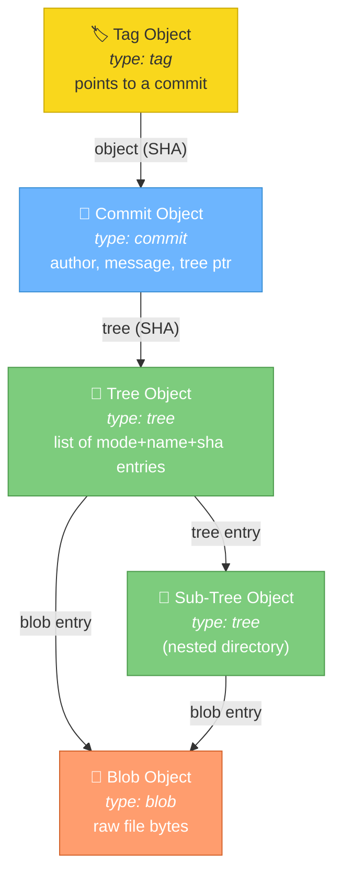

### 3.2 How a Commit Chain Looks (History)

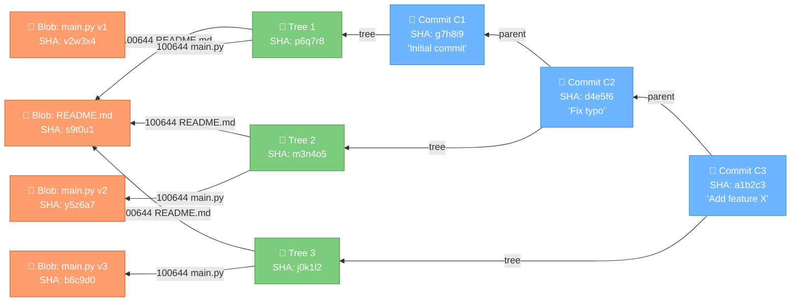

> **Key insight:** `README.md` never changed across the three commits, so all three trees point to the **same blob SHA**. Git deduplicates automatically — no copying.

### 3.3 A Merge Commit (Two Parents)

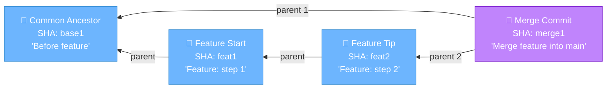

---

## 4. A Concrete Example: Files → Objects

### 4.1 The Project Layout

Suppose you have this project:

```
my-project/
├── README.md
├── src/
│   ├── main.py
│   └── utils.py
└── tests/
    └── test_main.py
```

### 4.2 The Full Object Graph for One Commit

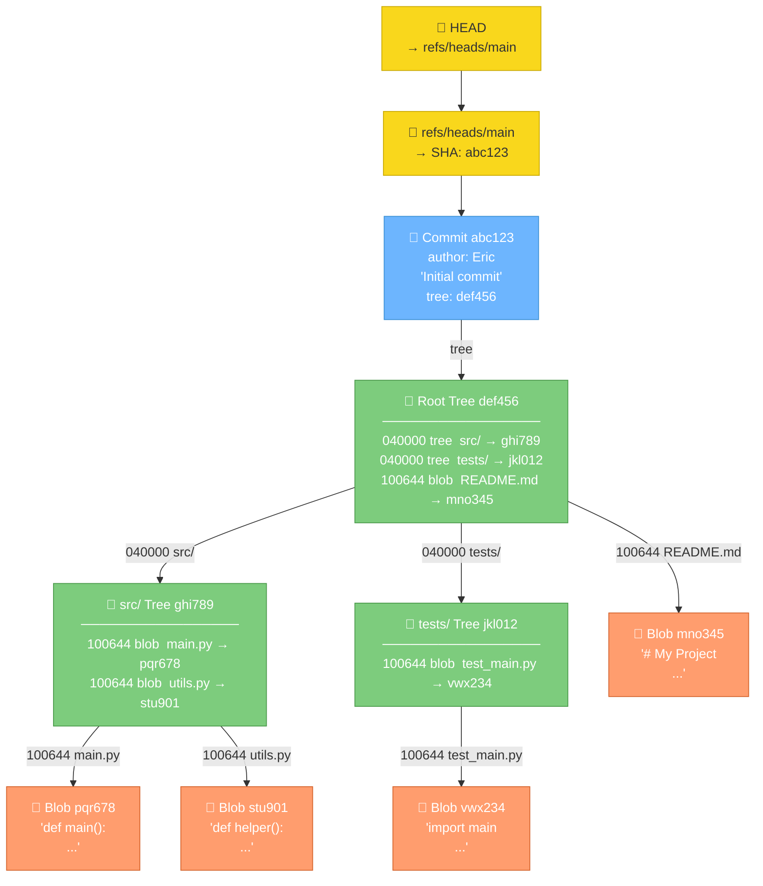

---

## 5. The .git Directory on Disk

### 5.1 Directory Structure

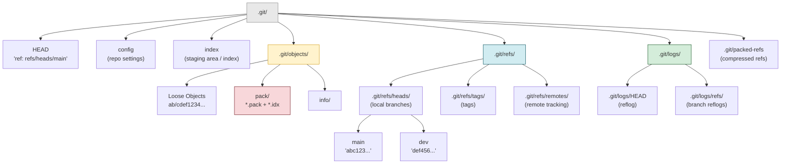

### 5.2 How an Object SHA Maps to a File Path

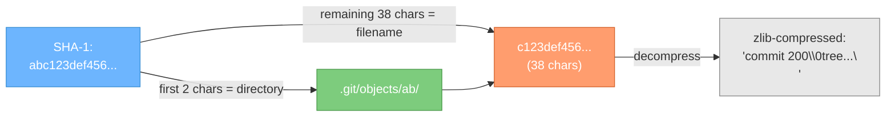

### 5.3 Object Wire Format (What's Inside Each File)

| Object Type | Stored As |
|-------------|-----------|
| Blob | `blob <length>\0<raw bytes>` |
| Tree | `tree <length>\0<mode> <name>\0<20-byte-sha>...` (repeating) |
| Commit | `commit <length>\0tree <sha><br/>parent <sha><br/>author...<br/>committer...<br/><br/><message>` |
| Tag | `tag <length>\0object <sha><br/>type <type><br/>tag <name><br/>tagger...<br/><br/><message>` |

Pack files (`.git/objects/pack/`) are created by `git gc` and bundle many objects together for efficiency. The `.idx` file provides an offset table into the `.pack` file.

---

## 6. Refs, Branches, Tags, and HEAD

### 6.1 The Ref System

A **ref** is just a file containing a 40-character SHA-1 (or a symbolic ref pointing to another ref). That's it.

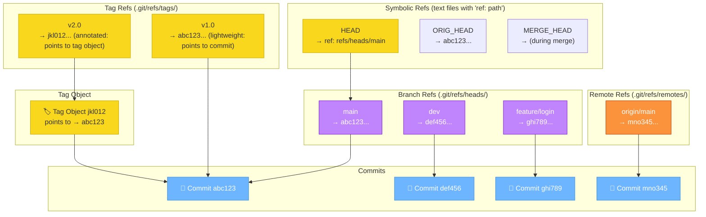

### 6.2 Detached HEAD State

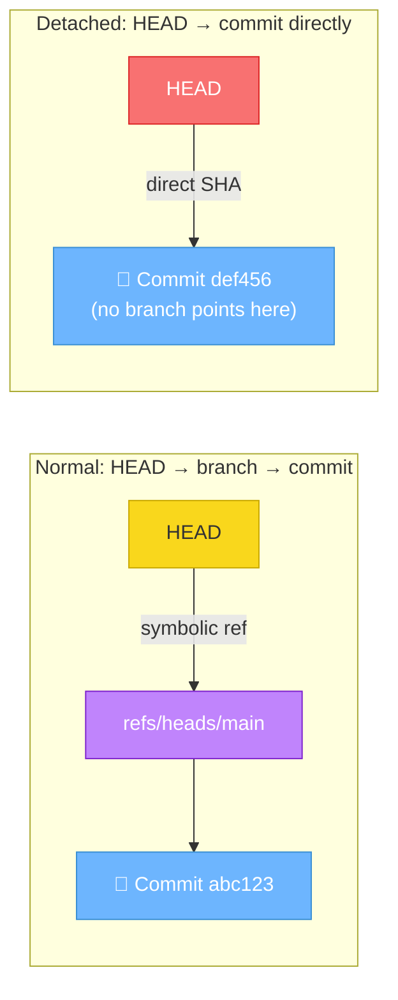

> **Warning:** In detached HEAD, new commits you make won't be reachable after you switch branches unless you create a branch first.

---

## 7. The Three Trees

Git manages three "trees" (not tree objects, but tree-structured data structures):

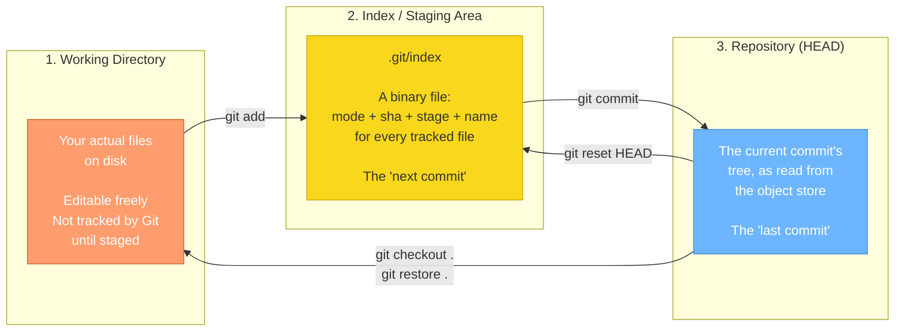

### 7.1 What git status Actually Does

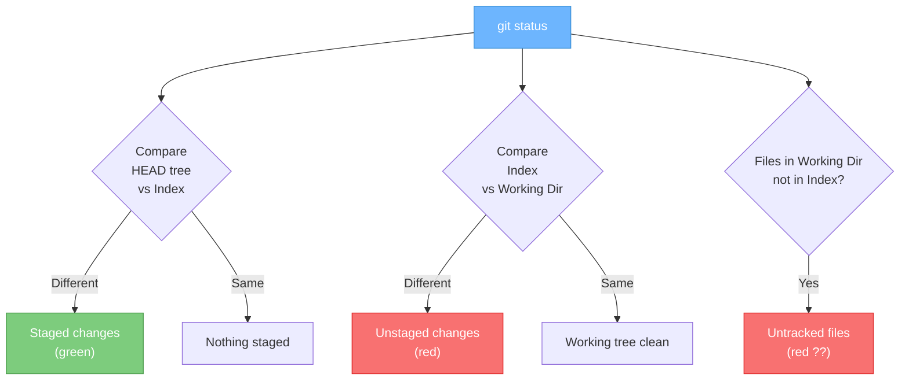

---

## 8. The Full Picture

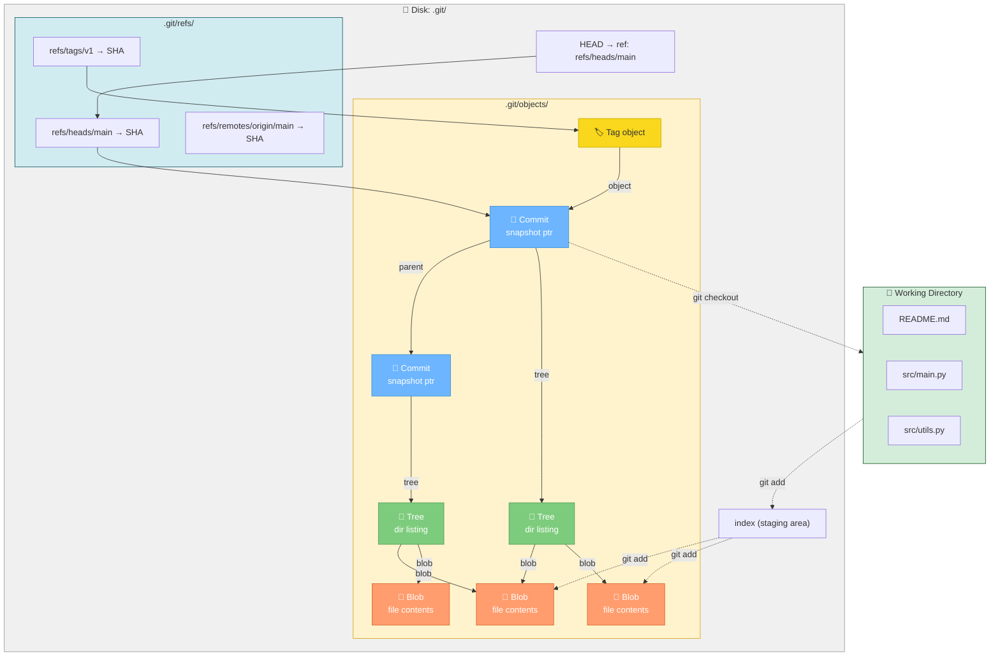

---

## 9. CLI Cheat Sheet: Querying Objects

### 9.1 The Swiss Army Knife: `git cat-file`

`git cat-file` is the **primary tool** for inspecting raw Git objects.

| Command | What it shows | Example |
|---------|--------------|---------|
| `git cat-file -t <sha>` | **Type** of object | `blob`, `tree`, `commit`, `tag` |
| `git cat-file -s <sha>` | **Size** in bytes | `1234` |
| `git cat-file -p <sha>` | **Pretty-print** contents | (see below) |
| `git cat-file --batch` | Read many SHAs from stdin | `echo sha \| git cat-file --batch` |
| `git cat-file --batch-all-objects --batch-check` | List ALL objects | Type+size of every object |

```bash
# Inspect a commit
git cat-file -p HEAD
# tree a1b2c3d4...
# parent e5f6a7b8...
# author Eric Ziko <e@z.com> 1708000000 +0200
# committer Eric Ziko <e@z.com> 1708000000 +0200
#
# My commit message

# Inspect a tree (root tree of HEAD)
git cat-file -p HEAD^{tree}
# 040000 tree a1b2...  src
# 100644 blob c3d4...  README.md

# Inspect a blob
git cat-file -p HEAD:README.md
# (raw file contents)

# Inspect a nested path
git cat-file -p HEAD:src/main.py
```

### 9.2 Listing Tree Contents: `git ls-tree`

```bash
# List the root tree of HEAD
git ls-tree HEAD

# List recursively (all files, all levels)
git ls-tree -r HEAD

# List with full object names
git ls-tree -r --name-only HEAD

# List a subdirectory
git ls-tree HEAD src/

# List a specific commit's tree
git ls-tree abc123def
```

Output format: `<mode> <type> <sha>\t<path>`

```
100644 blob a1b2c3d4e5f6...  README.md
040000 tree f7e8d9c0b1a2...  src
```

### 9.3 Walking History: `git log`

```bash
# Graph view with branches
git log --oneline --graph --all --decorate

# Show what changed in each commit
git log --stat

# Show diffs inline
git log -p

# Show specific file history
git log --follow -- src/main.py

# Show commits touching a string
git log -S "function_name" --all

# Show merge commits only
git log --merges --oneline

# Show commits between two refs
git log main..feature-branch

# Show ancestry: commits reachable from A but not B
git log A ^B

# Reverse: oldest first
git log --reverse

# Pretty format: hash, author, date, subject
git log --format="%h %an %ar %s"
```

### 9.4 Inspecting Refs

```bash
# Show what HEAD points to
cat .git/HEAD                     # symbolic: ref: refs/heads/main
git symbolic-ref HEAD             # refs/heads/main
git rev-parse HEAD                # full SHA

# Show all refs
git for-each-ref
git for-each-ref --format="%(refname) %(objectname:short) %(subject)"

# Show all branches (local + remote)
git branch -avv

# Show all tags with messages
git tag -n

# Show what a ref resolves to
git rev-parse main
git rev-parse v1.0^{}             # dereference tag to commit
git rev-parse HEAD~3              # 3 commits before HEAD
git rev-parse HEAD^2              # second parent (merge commit)
```

### 9.5 Ref Arithmetic (Revision Syntax)

| Syntax | Meaning |
|--------|---------|
| `HEAD` | Current commit |
| `HEAD^` or `HEAD~1` | Parent commit |
| `HEAD^^` or `HEAD~2` | Grandparent commit |
| `HEAD~N` | N commits back |
| `HEAD^2` | Second parent (merge commit) |
| `main@{3}` | Where main was 3 moves ago (reflog) |
| `main@{yesterday}` | Where main was yesterday |
| `v1.0^{}` | Dereference tag to the commit |
| `abc123:path/to/file` | Blob at path in commit |
| `HEAD^{tree}` | Root tree of HEAD commit |

### 9.6 Diffing Objects

```bash
# Diff working dir vs index (unstaged changes)
git diff

# Diff index vs HEAD (staged changes, "what will be committed")
git diff --cached
git diff --staged

# Diff working dir vs HEAD (all changes)
git diff HEAD

# Diff two commits
git diff abc123 def456

# Diff specific file between commits
git diff HEAD~3 HEAD -- src/main.py

# Diff two branches
git diff main..feature

# Diff just the names of changed files
git diff --name-only main..feature

# Show stats only
git diff --stat main..feature
```

### 9.7 Finding Objects

```bash
# Find object SHA for a file in the index
git ls-files -s src/main.py
# 100644 a1b2c3d4... 0  src/main.py

# Find all objects of a type
git cat-file --batch-all-objects --batch-check | grep '^.\{40\} blob'

# Find dangling (unreferenced) objects
git fsck --unreachable

# Find the blob SHA for a file at HEAD
git rev-parse HEAD:src/main.py

# Find commits that modified a file
git log --all --full-history -- path/to/file

# Find what introduced a bug (bisect)
git bisect start
git bisect bad HEAD
git bisect good v1.0
git bisect run ./test.sh    # automate
```

### 9.8 Inspecting the Index

```bash
# List all files in the staging area
git ls-files

# List with stage number, sha, and path
git ls-files -s

# List untracked files
git ls-files --others --exclude-standard

# Show diff between index and working dir
git diff

# Show diff between HEAD and index
git diff --cached
```

### 9.9 Object Plumbing Commands Quick Reference

```bash
# Hash a file (compute its blob SHA without storing)
git hash-object path/to/file

# Store a blob manually
echo "hello" | git hash-object --stdin -w

# Manually create a tree from the index
git write-tree

# Manually create a commit
git commit-tree <tree-sha> -p <parent-sha> -m "message"

# Update a ref
git update-ref refs/heads/my-branch <sha>

# Show reflog (local history of ref movements)
git reflog
git reflog show main
```

---

## 10. Vim-Fugitive Navigation Guide

Vim-Fugitive (by tpope) gives you a **Git-aware buffer layer** inside Vim. The key insight is that Fugitive lets you navigate the Git object graph using Vim's native movement keys.

### 10.1 The Fugitive Mental Model

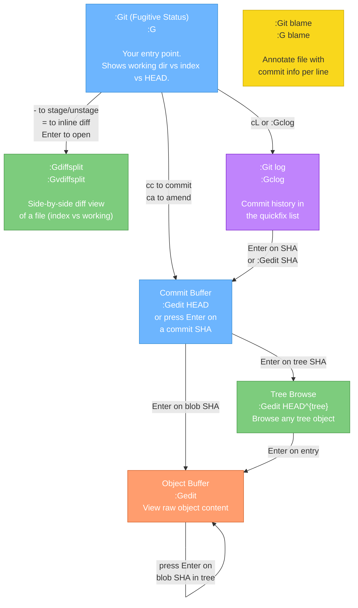

### 10.2 Core Fugitive Commands

| Command | Description |
|---------|-------------|
| `:Git` or `:G` | Open Fugitive status window |
| `:Gedit <object>` | Open any Git object (SHA, HEAD, HEAD:path) |
| `:Gread <object>` | Read object into current buffer |
| `:Gdiffsplit` | Diff current file (working dir vs index) |
| `:Gvdiffsplit` | Same, vertical split |
| `:Git log` | Run `git log` in a buffer |
| `:Gclog` | Load commit history into quickfix list |
| `:Git blame` | Blame current file |
| `:Git difftool` | Open diffs in quickfix |

### 10.3 Navigating the Status Window (`:G`)

```
:G  (opens status buffer)

┌─────────────────────────────────────────┐
│ Head: main                              │
│ Push: origin/main                       │
│                                         │
│ Staged Changes (2)                      │
│   M  src/main.py                        │
│   A  src/newfile.py                     │
│                                         │
│ Unstaged Changes (1)                    │
│   M  README.md                          │
│                                         │
│ Untracked Files (1)                     │
│   ?  scratch.py                         │
└─────────────────────────────────────────┘
```

| Key | Action |
|-----|--------|
| `s` | **Stage** file under cursor (or selection) |
| `u` | **Unstage** file under cursor |
| `-` | Toggle stage/unstage |
| `=` | Toggle inline diff for file under cursor |
| `>` / `<` | Expand / collapse inline diff |
| `Enter` | Open file in new split |
| `o` | Open file in horizontal split |
| `v` | Open file in vertical split |
| `t` | Open file in new tab |
| `p` | **Patch** — stage individual hunks interactively |
| `cc` | **Commit** staged changes |
| `ca` | Amend previous commit |
| `ce` | Amend without editing message |
| `cw` | Reword last commit message |
| `coo` | Checkout file (discard working dir changes) |
| `czz` | **Stash** |
| `czp` | Stash pop |
| `g?` | Help for all bindings |
| `q` | Close status window |

### 10.4 Navigating Commit History

```bash
# Open the git log in a scrollable buffer
:Git log --oneline --graph

# Load commits for CURRENT FILE into quickfix list (navigate with :cn, :cp)
:Gclog

# Load ALL commits into quickfix
:Gclog --all

# Load commits for a specific file
:Gclog -- %     # % = current file path
```

In the quickfix list (`:copen`):

| Key | Action |
|-----|--------|
| `Enter` | Jump to that commit |
| `:cn` | Next commit |
| `:cp` | Previous commit |

### 10.5 Navigating Objects — The Core Skill

This is where Fugitive shines for exploring the object graph. Use `:Gedit` as your navigation verb:

```vim
" Open a commit object
:Gedit HEAD
:Gedit abc123

" Open the root tree of HEAD
:Gedit HEAD^{tree}
:Gedit HEAD:

" Open a specific directory's tree
:Gedit HEAD:src/

" Open a specific file blob
:Gedit HEAD:src/main.py
:Gedit HEAD~3:src/main.py    " 3 commits ago

" Open a tag object
:Gedit v1.0
```

Once you're **inside a commit buffer** (`:Gedit HEAD`), the content looks like:

```
tree abc123def456...
parent 789ghi012jkl...
author Eric Ziko ...
committer Eric Ziko ...

My commit message
```

You can **press `Enter` on any SHA** and Fugitive will open that object. This lets you drill down:

```
Commit → (Enter on tree SHA) → Tree → (Enter on file entry) → Blob
```

### 10.6 Object Navigation Flow in Fugitive

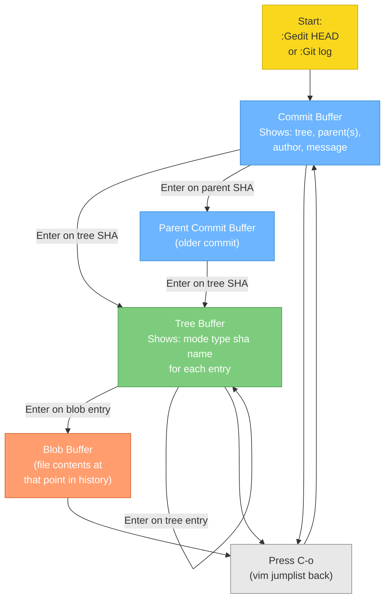

> **Key tip:** Use Vim's jump list (`Ctrl-O` to go back, `Ctrl-I` to go forward) to navigate the object graph like browser history.

### 10.7 Git Blame Navigation

```vim
" Open blame for current file
:Git blame
" or
:G blame
```

In the blame view:

| Key | Action |
|-----|--------|
| `Enter` or `o` | Open the commit that introduced this line |
| `O` | Open commit in new tab |
| `p` | Preview commit in preview window |
| `~` | Go to the version of the file before this commit |
| `C` | Navigate to parent commit |
| `g?` | Show all bindings |
| `q` | Close blame |

### 10.8 Diff Navigation (`:Gdiffsplit`)

```vim
" Diff current file (working dir vs index)
:Gdiffsplit
:Gvdiffsplit    " vertical

" Diff current file against HEAD (working dir vs HEAD)
:Gdiffsplit HEAD

" Diff current file at two specific commits
:Gdiffsplit main..feature    " not quite right for files, use:
:Gedit main:% | Gvdiffsplit feature:%
```

In diff view, use standard Vim diff navigation:

| Key | Action |
|-----|--------|
| `]c` | Next change |
| `[c` | Previous change |
| `do` | Diff obtain (get change from other window) |
| `dp` | Diff put (send change to other window) |
| `:diffupdate` | Refresh diff |

### 10.9 Fugitive + Quickfix Workflow

```vim
" Search for a string across all commits (like git log -S)
:Git log -S "my_function" --all
" Then open the quickfix-style list and navigate

" See all commits that touched a file
:Gclog -- path/to/file.py

" Navigate quickfix
:copen      " open list
:cn         " next item
:cp         " previous item
:cc 5       " jump to item 5
```

### 10.10 Complete Fugitive Mental Map

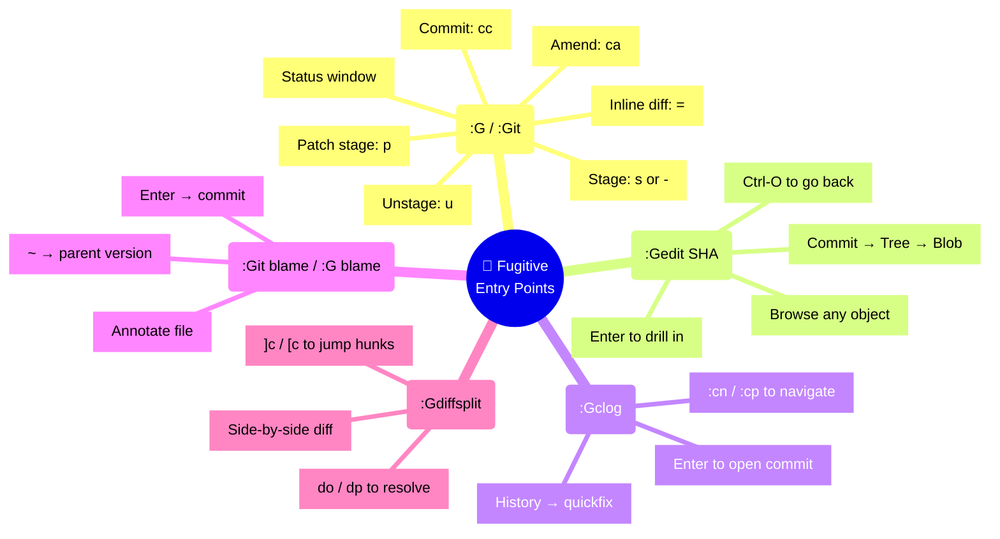

---

## Quick Reference Card

```
┌──────────────────────────────────────────────────────────────┐
│                  GIT OBJECT QUICK REFERENCE                  │
├─────────────┬────────────────────────────────────────────────┤
│ Object Type │ CLI to Inspect                                 │
├─────────────┼────────────────────────────────────────────────┤
│ Any object  │ git cat-file -t <sha>   (type)                 │
│             │ git cat-file -p <sha>   (contents)             │
├─────────────┼────────────────────────────────────────────────┤
│ Commit      │ git cat-file -p HEAD                           │
│             │ git log --oneline --graph --all                │
│             │ git show HEAD                                  │
├─────────────┼────────────────────────────────────────────────┤
│ Tree        │ git ls-tree HEAD                               │
│             │ git ls-tree -r HEAD   (recursive)              │
│             │ git cat-file -p HEAD^{tree}                    │
├─────────────┼────────────────────────────────────────────────┤
│ Blob        │ git cat-file -p HEAD:path/to/file              │
│             │ git show HEAD:path/to/file                     │
├─────────────┼────────────────────────────────────────────────┤
│ Tag         │ git cat-file -p v1.0                           │
│             │ git tag -n   (list with messages)              │
├─────────────┼────────────────────────────────────────────────┤
│ Refs        │ git for-each-ref                               │
│             │ git rev-parse HEAD                             │
│             │ git symbolic-ref HEAD                          │
├─────────────┼────────────────────────────────────────────────┤
│ Index       │ git ls-files -s                                │
│             │ git diff --cached                              │
└─────────────┴────────────────────────────────────────────────┘

┌──────────────────────────────────────────────────────────────┐
│              FUGITIVE NAVIGATION QUICK REFERENCE             │
├──────────────────────────┬───────────────────────────────────┤
│ :G                       │ Status window                     │
│ :Gedit HEAD              │ Open current commit               │
│ :Gedit HEAD^{tree}       │ Open root tree of HEAD            │
│ :Gedit HEAD:src/         │ Open src/ tree                    │
│ :Gedit HEAD:src/file.py  │ Open file at HEAD                 │
│ :Gedit HEAD~3:src/f.py   │ Open file 3 commits ago           │
│ :Gclog                   │ History → quickfix                │
│ :Git blame               │ Blame current file                │
│ :Gdiffsplit              │ Diff current file                 │
│ Enter (on SHA in buffer) │ Drill into that object            │
│ Ctrl-O                   │ Go back (jump list)               │
│ Ctrl-I                   │ Go forward (jump list)            │
└──────────────────────────┴───────────────────────────────────┘
```

---

## Key Insights to Internalize

1. **Everything is a SHA.** Commits, trees, blobs, and tags are all just SHA-addressed objects in `.git/objects/`. A branch is just a file containing a SHA.
2. **A commit is a snapshot, not a diff.** Git stores full trees, not deltas. The "diff" you see with `git show` is computed on the fly by comparing a commit's tree to its parent's tree.
3. **Content deduplication is automatic.** Identical file contents = identical SHA = stored once. Unchanged files cost nothing in new commits.
4. **Branches are just 41-byte files.** `cat .git/refs/heads/main` will show you a SHA. Moving a branch is just overwriting that file.
5. **HEAD is the "you are here" marker.** It either points to a branch ref (normal) or directly to a SHA (detached HEAD).
6. **The index is the "next commit".** `git add` updates it. `git commit` turns it into a tree object and wraps it in a commit object.
7. **Fugitive's superpower is `Enter`.** When viewing any Git object buffer, pressing `Enter` on a SHA navigates into that object. Use `Ctrl-O` to backtrack. This gives you a browser-like traversal of the object graph.
