# Git Fixup Commits: A Complete Tutorial

## What Are Fixup Commits?

A **fixup commit** is a commit that fixes a bug or makes a small change to a *previous commit* without creating a new logical change in the history. Instead of amending that commit directly, you create a new commit marked as a "fixup" that will be automatically squashed into the original during a rebase.

### Why Use Fixup Commits?

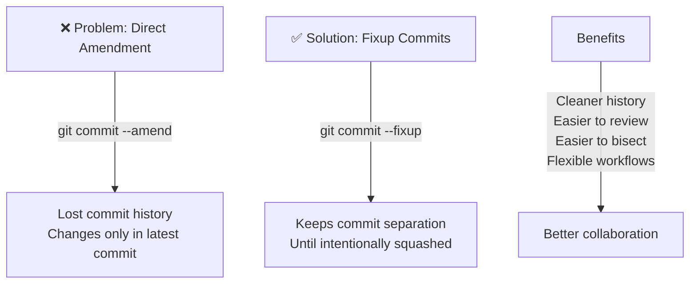

Think of it this way: fixup commits are **"work in progress"** markers that say *"this commit belongs with the one I'm fixing"* without destroying the original commit's history yet.

---

## Part 1: Creating Fixup Commits with `git commit --fixup`

### The Concept

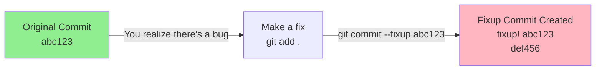

### How It Works

When you run:
```bash
git commit --fixup <original-commit-hash>
```

Git automatically creates a new commit with a special message format:

```
fixup! <original commit message>
```

The fixup commit sits *after* the original in the history, waiting to be squashed later.

### Visual Example: Before and After

**Before Fixup Commit:**

```
commit abc123 - Feature: Add user authentication
    - Implement login endpoint
    - Add password hashing
    - (Bug: forgot SQL NULL check)
```

**After `git commit --fixup abc123`:**

```
commit abc123 - Feature: Add user authentication
    - Implement login endpoint
    - Add password hashing
    - (Bug: forgot SQL NULL check)

commit def456 - fixup! Feature: Add user authentication
    - Add missing NULL check in query
```

---

## Part 2: Understanding the Fixup Workflow

### Complete Workflow Diagram

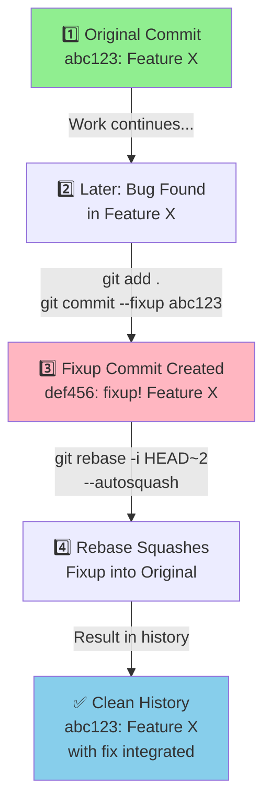

### Step-by-Step Example

Let's say you have this history:

```
commit 3 - Add tests
commit 2 - Feature: User login
commit 1 - Setup project
```

**Step 1: Create a fixup commit**

```bash
# Find the bug in commit 2
git checkout HEAD~1  # Go back to commit 2
# ... fix the bug ...
git add .
git commit --fixup 2abcde  # Create fixup for commit 2
```

**Step 2: Your history now looks like:**

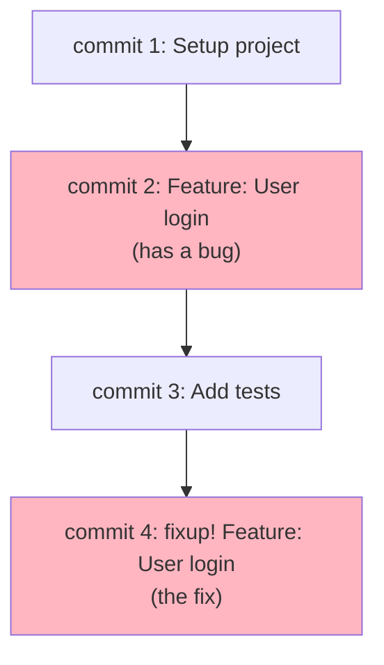

**Step 3: Use autosquash to merge fixup into original**

```bash
git rebase -i --autosquash HEAD~3
```

**Step 4: Result - clean history**

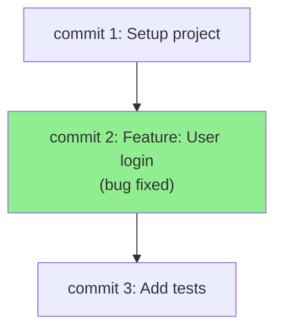

---

## Part 3: Git Rebase --Autosquash

### What is Autosquash?

`--autosquash` is a flag that automatically **reorders and marks fixup/squash commits** during an interactive rebase, so you don't have to manually edit the rebase plan.

### Without Autosquash (Manual Process)

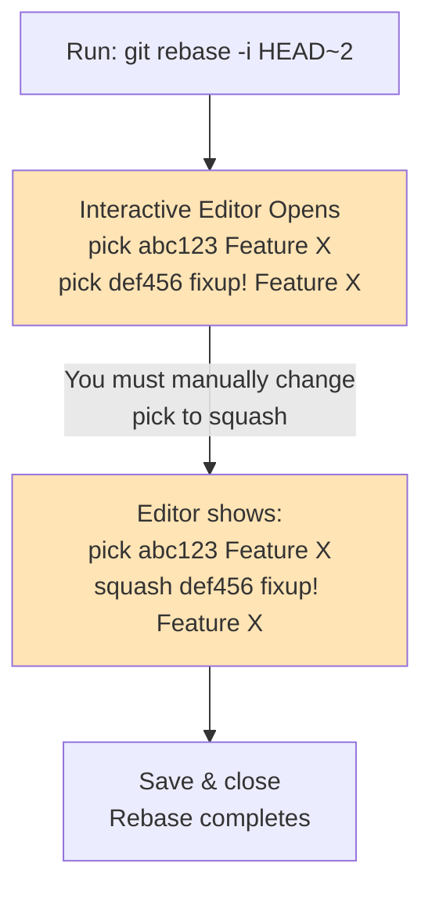

### With Autosquash (Automatic Process)

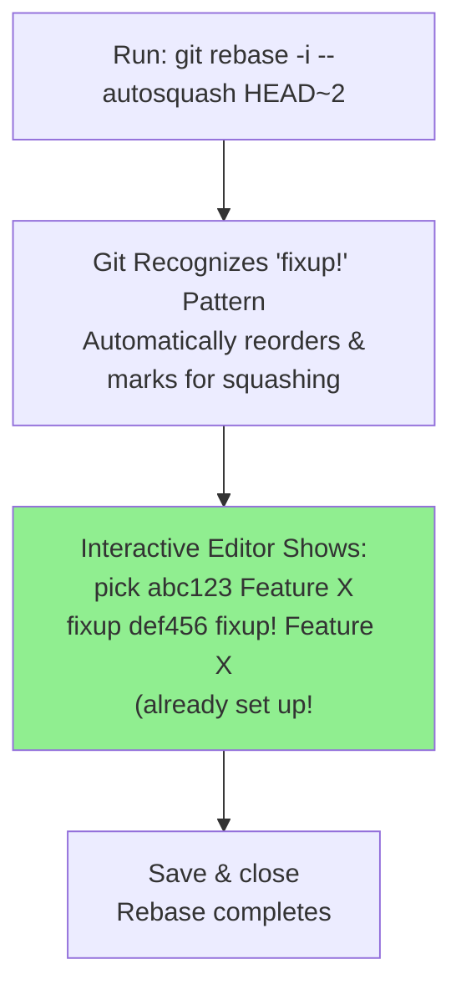

### Visual Comparison

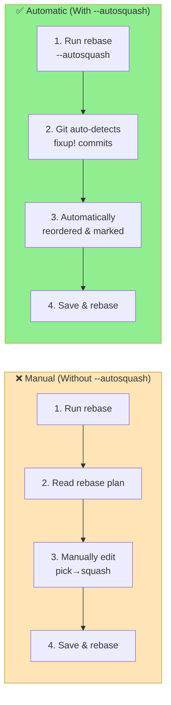

### Before vs. After Autosquash

**Before (what git sees):**

```
def456 - fixup! Feature: User login
abc123 - Feature: User login
```

**After autosquash reorders (what interactive rebase shows):**

```
pick abc123 - Feature: User login
fixup def456 - fixup! Feature: User login
```

---

## Part 4: Manual Fixup Workflows (Without Autosquash)

Sometimes you want to manually control how commits are combined. Here's how:

### Scenario: Manually Squashing Multiple Commits

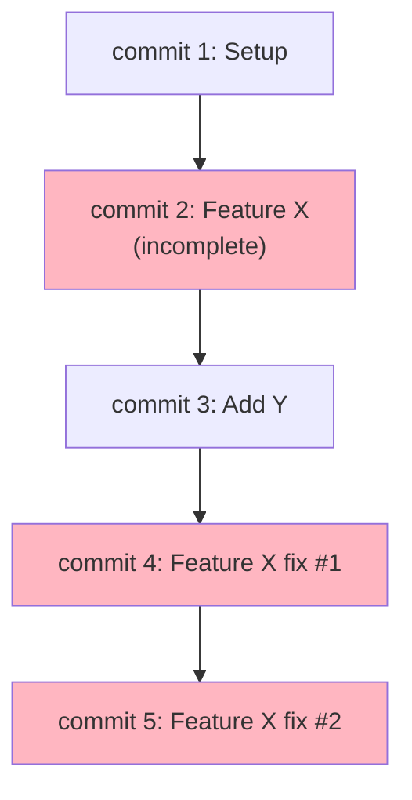

### Manual Rebase Process

```bash
# Start interactive rebase from 4 commits ago
git rebase -i HEAD~4
```

**Interactive Rebase Editor Opens:**

```
pick 2abcde Feature X (incomplete)
pick 3bcdef Add Y
pick 4cdefg Feature X fix #1
pick 5defgh Feature X fix #2
```

**You manually edit to:**

```
pick 2abcde Feature X (incomplete)
squash 4cdefg Feature X fix #1
squash 5defgh Feature X fix #2
pick 3bcdef Add Y
```

(Note: You move the fixups right after the original commit and change `pick` to `squash`)

**Result:**

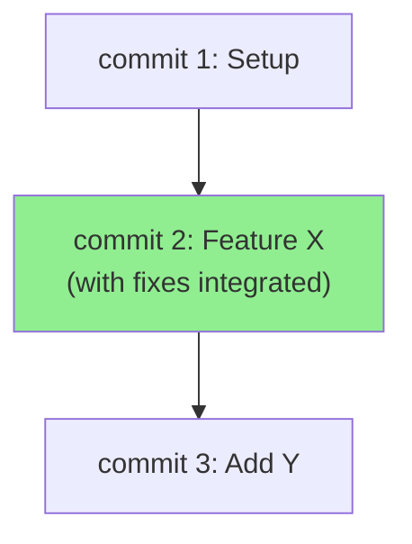

### Rebase Commands Explained

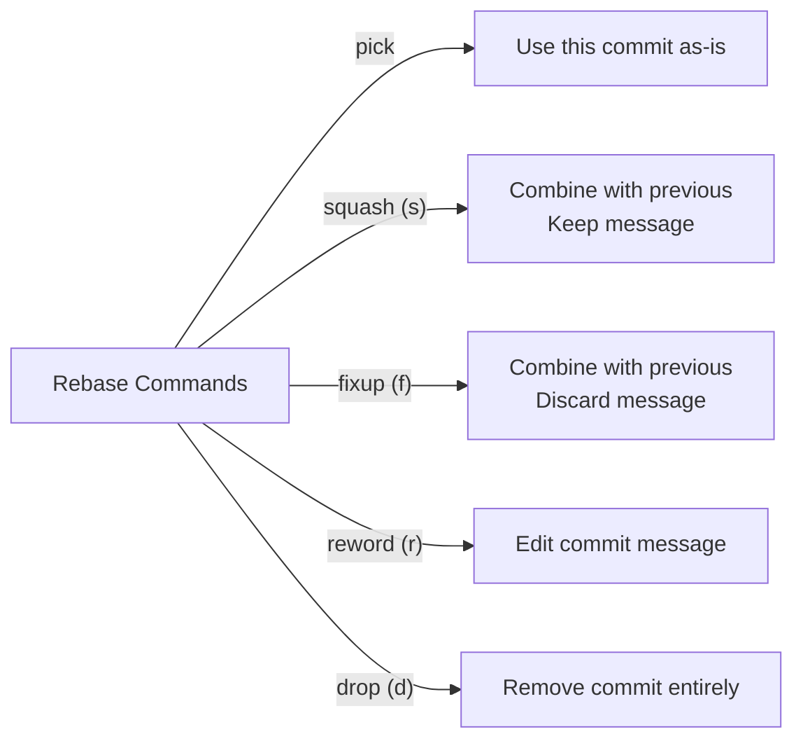

---

## Part 5: Interactive Rebase Visual Walkthrough

### Complete Interactive Rebase State Machine

```mermaid
stateDiagram-v2
    [*] --> Editor: "git rebase -i HEAD~N"

    Editor --> Review: "Rebase plan opens<br/>List of commits with action"

    Review --> Decide: "Decide for each commit:<br/>pick? squash? reword?"

    Decide --> Edit: "Make changes to<br/>pick/squash/etc"

    Edit --> Save: "Save & exit editor"

    Save --> Process: "Git processes rebase<br/>Applies commits in order"

    Process --> Conflict{Merge<br/>Conflicts?}

    Conflict -->|Yes| Resolve: "Resolve conflicts<br/>git add .<br/>git rebase --continue"
    Conflict -->|No| Complete: "Rebase complete"

    Resolve --> Process

    Complete --> [*]
```

### Real Example: Step-by-Step

**Initial State (5 commits with fixup):**

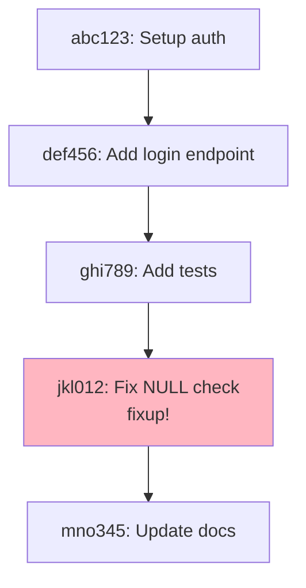

**Command Executed:**

```bash
$ git rebase -i --autosquash HEAD~4
```

**Rebase Editor Opens (with autosquash applied):**

```
pick abc123 Setup auth
pick def456 Add login endpoint
fixup jkl012 Fix NULL check
pick ghi789 Add tests
pick mno345 Update docs
```

**You modify to reword one commit:**

```
pick abc123 Setup auth
pick def456 Add login endpoint
fixup jkl012 Fix NULL check
reword ghi789 Add tests
pick mno345 Update docs
```

**Save, then editor opens for reword:**

```
Add tests
# Edit the above line
```

**Change to:**

```
Add comprehensive unit tests for auth
```

**Save again, rebase continues and completes:**

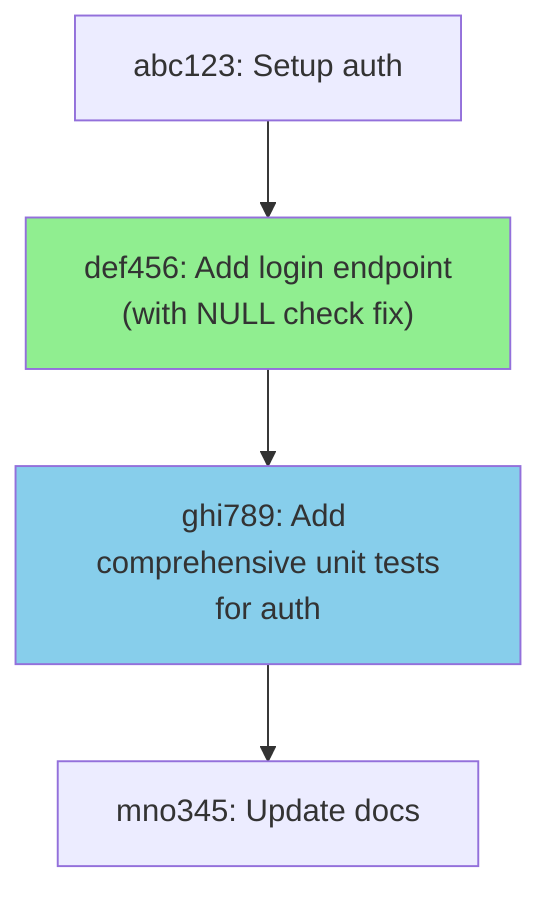

---

## Part 6: Practical Workflow Examples

### Workflow 1: Single Fixup Commit

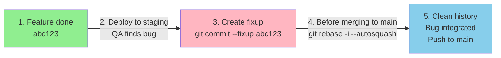

**Commands:**

```bash
# Step 1: Do your work, commit normally
git commit -m "Feature: Add password reset"  # abc123

# ... Later: Bug found

# Step 2: Fix the bug
git add .
git commit --fixup abc123  # Creates new commit

# Step 3: Before pushing, clean up
git rebase -i --autosquash HEAD~2

# Step 4: Push clean history
git push origin feature-branch
```

### Workflow 2: Multiple Fixups for Same Commit

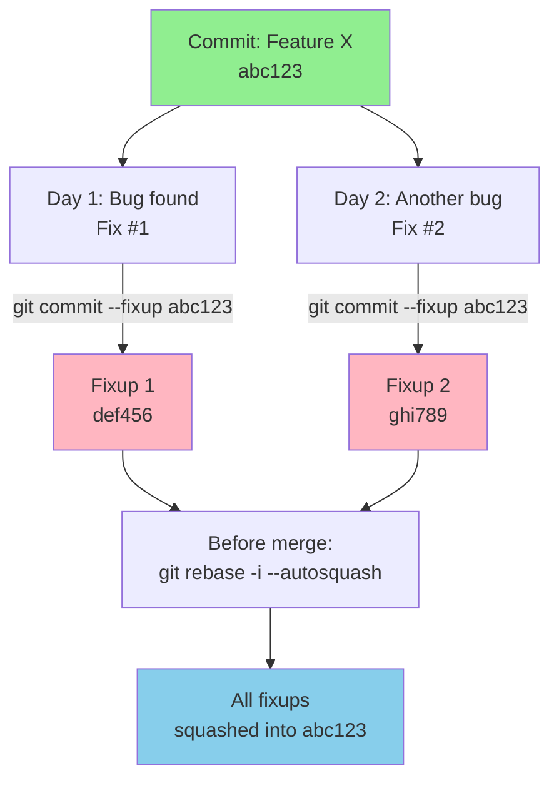

**Commands:**

```bash
# Day 1
git commit --fixup abc123

# Day 2
git commit --fixup abc123

# Before merge - both fixups auto-squash
git rebase -i --autosquash HEAD~3

# Result: clean history with all fixes integrated
```

### Workflow 3: Staging Area with Fixup

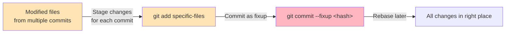

---

## Part 7: Best Practices & Tips

### ✅ DO

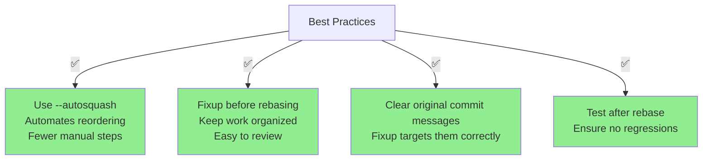

### ❌ DON'T

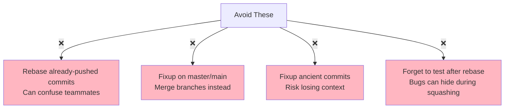

### Common Issues & Solutions

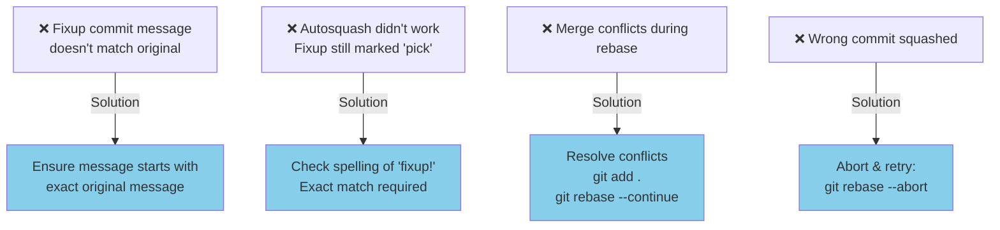

---

## Part 8: Quick Reference

### Command Cheat Sheet

```bash
# Create a fixup commit (commits changes as fixup of original)
git commit --fixup <commit-hash>

# Interactive rebase with autosquash enabled
git rebase -i --autosquash HEAD~<number-of-commits>

# Shorthand for rebase (no -i needed if only squashing)
git rebase --autosquash HEAD~3

# If something goes wrong, abort
git rebase --abort

# Continue after resolving conflicts
git rebase --continue

# View original commit message for fixup reference
git log --oneline | grep "Feature"

# See what will be squashed
git log --oneline HEAD~5..HEAD
```

### Decision Tree: When to Use Fixup

```mermaid
graph TD
    A["Is there a mistake in<br/>a recent commit?"] -->|Yes| B["Is it the LAST commit?"]

    B -->|Yes| C["Just use<br/>git commit --amend"]
    B -->|No| D["Use fixup commit<br/>git commit --fixup &lt;hash&gt;"]

    A -->|No| E["Need to combine<br/>multiple commits?"]
    E -->|Yes| F["Use interactive rebase<br/>git rebase -i --autosquash"]
    E -->|No| G["Create new feature<br/>commit (normal flow)"]

    style C fill:#87CEEB
    style D fill:#90EE90
    style F fill:#90EE90
    style G fill:#87CEEB
```

---

## Summary

```mermaid
graph TB
    A["Git Fixup Commits"]

    A -->|"Core Concept"| B["Special commits that<br/>mark 'this fixes previous'<br/>Using 'fixup!' prefix"]

    A -->|"Creation"| C["git commit --fixup &lt;hash&gt;<br/>Creates marked commit"]

    A -->|"Integration"| D["git rebase -i --autosquash<br/>Auto-squashes into original"]

    A -->|"Benefits"| E["✅ Clean history<br/>✅ Easier reviews<br/>✅ Flexible workflow<br/>✅ Keeps original commit"]

    A -->|"When to Use"| F["Bug fixes in recent commits<br/>Code review feedback<br/>Testing iterations<br/>Before merging PR"]

    style A fill:#4A90E2
    style B fill:#90EE90
    style C fill:#90EE90
    style D fill:#90EE90
    style E fill:#FFD700
    style F fill:#FFD700
```

---

## Final Example: Complete Workflow

Let's put it all together:

```bash
# 1. You're working on a feature
git log --oneline
# 5 - docs: Update README
# 4 - feat: Add user validation
# 3 - feat: Add login endpoint  ← Found a bug here
# 2 - chore: Setup project
# 1 - Initial commit

# 2. You find a bug in commit 3 and fix it
git add .
git commit --fixup 3abc123  # Creates "fixup! feat: Add login endpoint"

# 3. Continue working normally (can create more fixups)
git add docs/
git commit -m "docs: Update README"

# 4. Before submitting PR, clean up history
git rebase -i --autosquash HEAD~3

# 5. Interactive editor shows:
# pick 3abc123 feat: Add login endpoint
# fixup 6def456 fixup! feat: Add login endpoint
# pick 5bcde12 docs: Update README

# 6. Save and close - rebase completes automatically

# 7. History is now clean:
git log --oneline
# 5 - docs: Update README
# 4 - feat: Add login endpoint (with bug fix integrated)
# 3 - feat: Add user validation
# 2 - chore: Setup project
# 1 - Initial commit

# 8. Push to your feature branch
git push -f origin feature-branch  # -f because history changed (safe on feature branches)
```

---

## Resources & Further Reading

- Git documentation: https://git-scm.com/docs/git-commit
- Interactive rebase guide: https://git-scm.com/book/en/v2/Git-Tools-Rewriting-History
- Autosquash in depth: https://git-scm.com/docs/git-rebase#Documentation/git-rebase.txt---autosquash

---

**Happy committing! 🚀**
