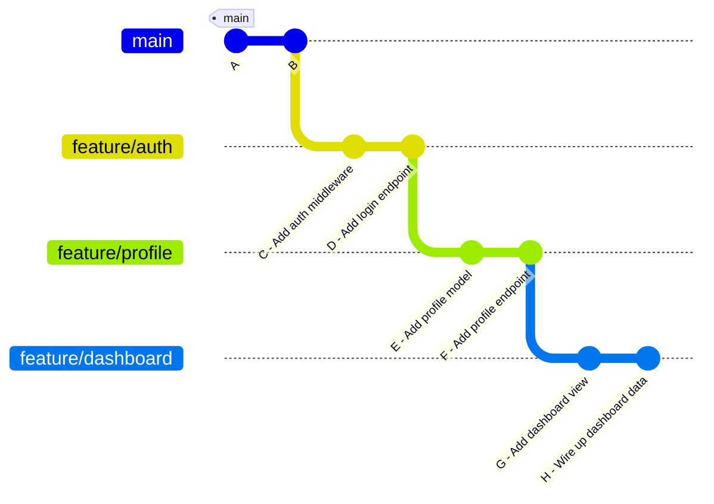
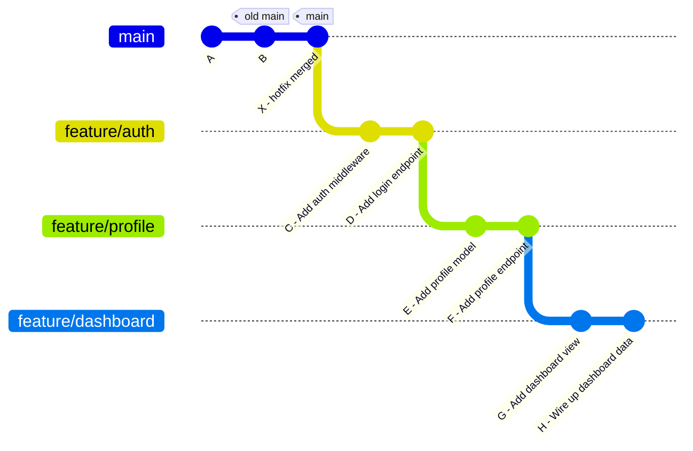
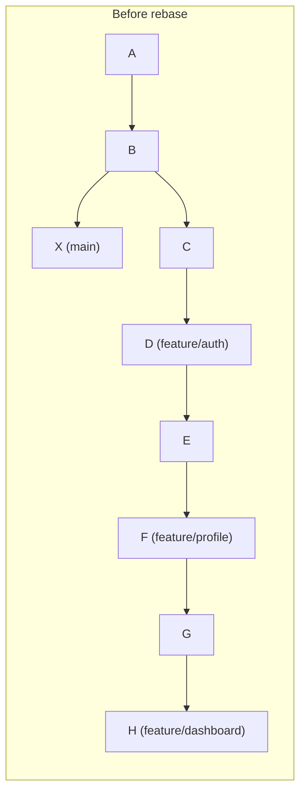
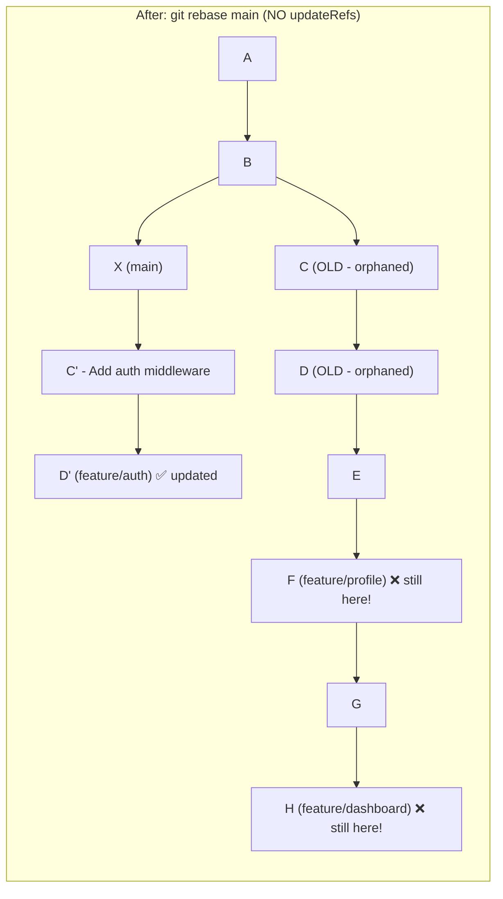
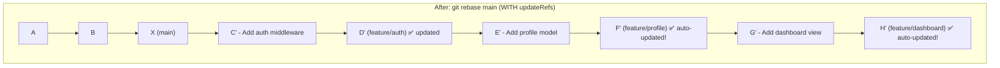
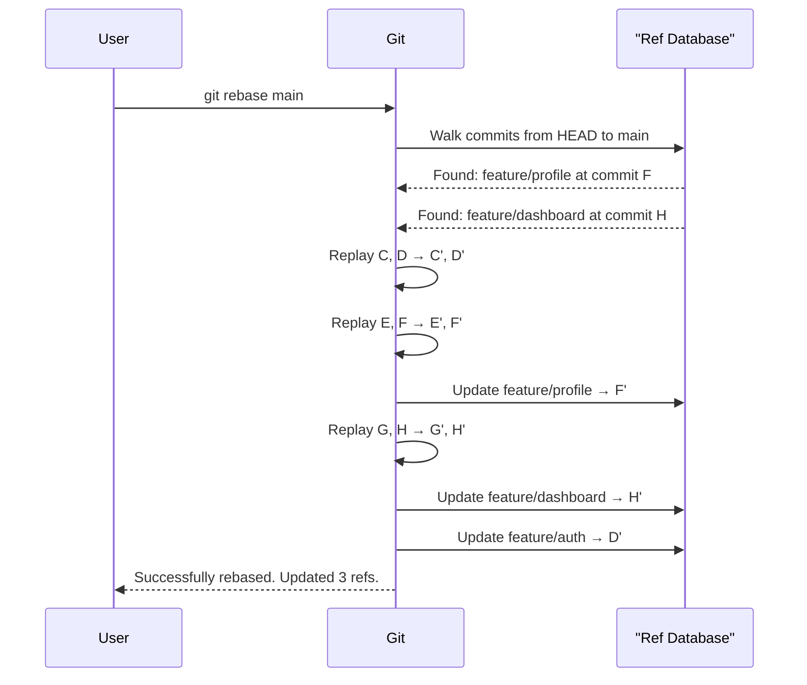
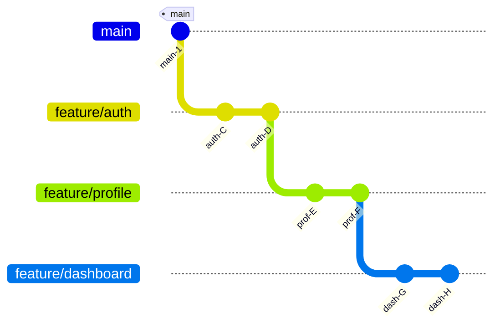
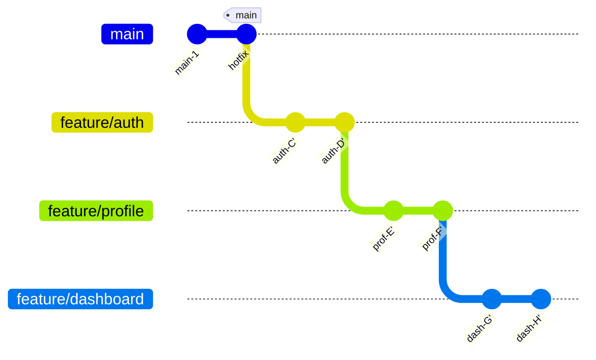
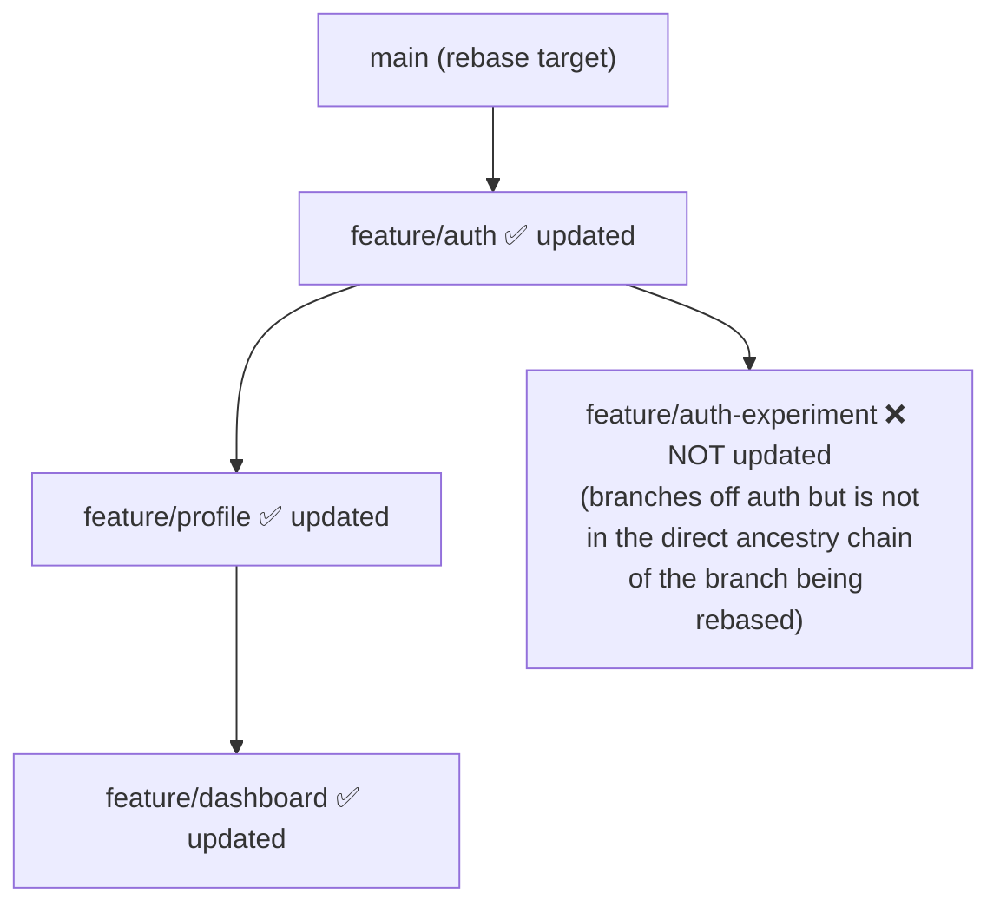
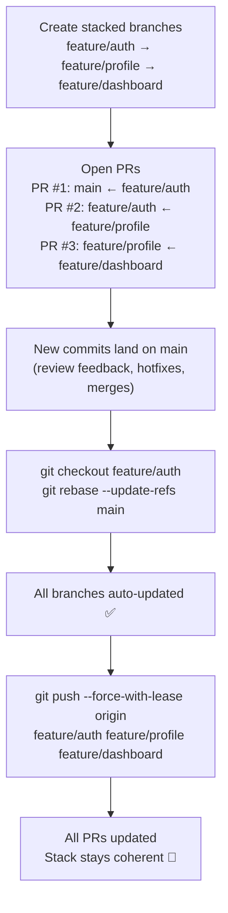

# 🤖❓ Git `[rebase] updateRefs = true` — The Complete Guide

## 🤖💡 What Problem Does This Solve?

Modern git workflows often involve **stacked branches** — a chain of feature branches where each one builds on top of the previous. This is common when:

- A feature depends on another in-progress feature
- You split a large PR into reviewable chunks
- You work on related sub-tasks in sequence

The classic pain point: **when you rebase the bottom of the stack, the branches above it all get orphaned.** `updateRefs = true` fixes this automatically.

---

## 📐 Understanding Stacked Branches

### 🌳 The Initial State

Imagine you are building a feature in three layers:

```
main
  └── feature/auth        (PR #1 — adds login)
        └── feature/profile  (PR #2 — uses login)
              └── feature/dashboard (PR #3 — uses profile)
```



Each branch is **stacked** — `feature/profile` branches off `feature/auth`, and `feature/dashboard` branches off `feature/profile`.

---

## 😱 The Problem: Rebasing Without `updateRefs`

### Scenario: Main gets new commits, you need to rebase

New commits land on `main` (e.g., a hotfix or merged PR). You need to bring `feature/auth` up to date.



You run:

```bash
git checkout feature/auth
git rebase main
```

### 🔴 What Happens Without `updateRefs`

Git replays `feature/auth`'s commits onto `main`, creating **new commits** `C'` and `D'`.





**The disaster:**
- `feature/auth` now correctly points to `D'` (new commit on top of `main`)
- `feature/profile` still points to `F`, which is built on the **old** `D` commit
- `feature/dashboard` still points to `H`, built on the **old** `F`
- Your entire stack is now **disconnected and inconsistent**

To fix this, you would have to manually rebase each branch:

```bash
git checkout feature/profile
git rebase feature/auth   # painful

git checkout feature/dashboard
git rebase feature/profile  # painful again
```

Each rebase risks conflicts that you have to resolve one by one, even if the actual code changes are trivial.

---

## ✅ The Solution: `updateRefs = true`

### Configure It

Add this to your global or local `.gitconfig`:

```ini
[rebase]
    updateRefs = true
```

Or enable it per-command:

```bash
git rebase --update-refs main
```

### 🟢 What Happens With `updateRefs`

When you rebase `feature/auth` onto `main`, git **detects all intermediate branch refs** that are in the chain and **automatically updates them all**.



**All three branches are automatically replayed** onto the new base. The entire stack moves together.

---

## 🔬 How Git Detects Intermediate Refs

Git is clever about this. When you run the rebase, it:

1. Walks the commit history from the current branch tip back toward the base
2. At each commit, checks: **does any branch ref point here?**
3. If yes, records it as an "intermediate ref to update"
4. After replaying all commits, moves each recorded ref to its corresponding new commit



---

## 📊 Side-by-Side Comparison

| Scenario | Without `updateRefs` | With `updateRefs = true` |
|---|---|---|
| Rebase bottom of stack | Only bottom branch moves | **Entire stack moves** |
| Intermediate branches | Left pointing at orphaned commits | Automatically updated |
| Manual cleanup required | Yes — rebase each branch | No |
| Risk of conflicts | Multiplied (one per branch) | Handled in one pass |
| Stack consistency | Broken | Preserved |

---

## 🗂️ Full Worked Example

### Setup

```bash
# Start from main
git checkout main

# Create stacked branches
git checkout -b feature/auth
echo "auth code" > auth.ts && git add . && git commit -m "Add auth middleware"
echo "login" > login.ts && git add . && git commit -m "Add login endpoint"

git checkout -b feature/profile   # branches from feature/auth
echo "profile" > profile.ts && git add . && git commit -m "Add profile model"
echo "profile api" >> profile.ts && git add . && git commit -m "Add profile endpoint"

git checkout -b feature/dashboard  # branches from feature/profile
echo "dashboard" > dashboard.ts && git add . && git commit -m "Add dashboard view"
echo "wired" >> dashboard.ts && git add . && git commit -m "Wire up dashboard data"
```

### Initial State



### A new commit lands on main

```bash
git checkout main
echo "hotfix" > hotfix.ts && git add . && git commit -m "Critical hotfix"
```

### Rebase with updateRefs

```bash
git checkout feature/auth
git rebase --update-refs main
# or, if configured globally, just:
# git rebase main
```

### Output you'll see

```
Successfully rebased and updated refs/heads/feature/auth.
Updated refs/heads/feature/profile (was abc1234).
Updated refs/heads/feature/dashboard (was def5678).
```

### Final State



All three branches now sit cleanly on top of the hotfix. Stack is preserved. No manual intervention needed.

---

## ⚠️ Caveats and Edge Cases

### 🔁 Force Push Required

Because all the commits in the stack are rewritten (they get new SHA hashes), you must force-push any branches that have already been pushed to a remote:

```bash
git push --force-with-lease origin feature/auth feature/profile feature/dashboard
```

> `--force-with-lease` is safer than `--force`: it refuses to push if the remote has commits you haven't seen, protecting against accidentally overwriting teammates' work.

### 👥 Shared Branches

If teammates are working on the same branches, rewriting history with `--update-refs` will cause divergence for them. This workflow is best for:

- **Solo stacks** where only you work on those branches
- **PR-per-branch** workflows where branches aren't shared directly

### 🏷️ Only Detects Refs in the Ancestry

Git only updates refs that sit **between the current HEAD and the rebase target**. It won't touch branches that branch off the stack sideways or below the rebase base.



---

## 🛠️ Configuration Reference

### Global (applies to all repos)

```bash
git config --global rebase.updateRefs true
```

This writes to `~/.gitconfig`:

```ini
[rebase]
    updateRefs = true
```

### Per-Repo

```bash
git config rebase.updateRefs true
```

Writes to `.git/config` in the repo.

### Per-Command (without saving config)

```bash
git rebase --update-refs <base>
git rebase --update-refs main
git rebase --update-refs origin/main
```

### Disable Per-Command Even If Globally Enabled

```bash
git rebase --no-update-refs main
```

---

## 🧩 How This Fits Into a Stacked PR Workflow

`updateRefs` pairs naturally with tools like [gh](https://cli.github.com/) for managing stacked PRs:



---

## 🔑 Key Takeaways

- `[rebase] updateRefs = true` makes git **automatically move all intermediate branch refs** when you rebase a stack
- Without it, rebasing the base of a stack leaves all upper branches **pointing at orphaned commits**
- With it, a **single rebase command** keeps your entire stack coherent
- You still need to **force-push** all affected branches to the remote
- Best suited for **solo stacked branch workflows** — be careful on shared branches
- Available since **Git 2.38** (October 2022)

---

## 📚 Further Reading

- `man git-rebase` — search for `--update-refs`
- `git help config` — search for `rebase.updateRefs`
- [GitHub Blog: Stacked Pull Requests](https://github.blog) — workflows that benefit from this feature
