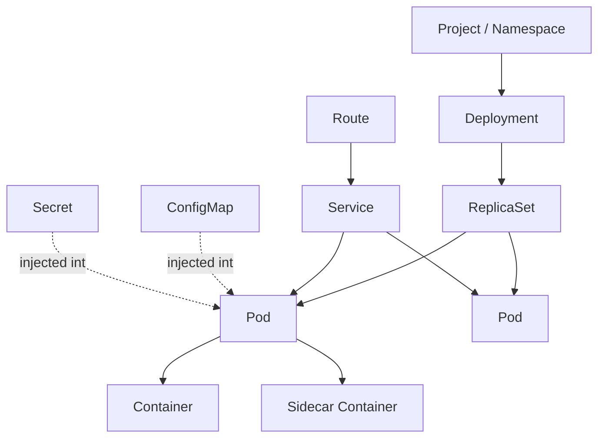
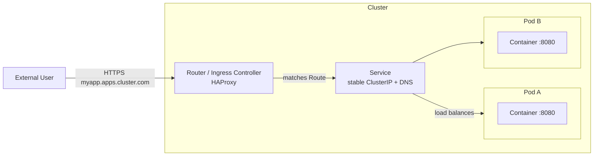
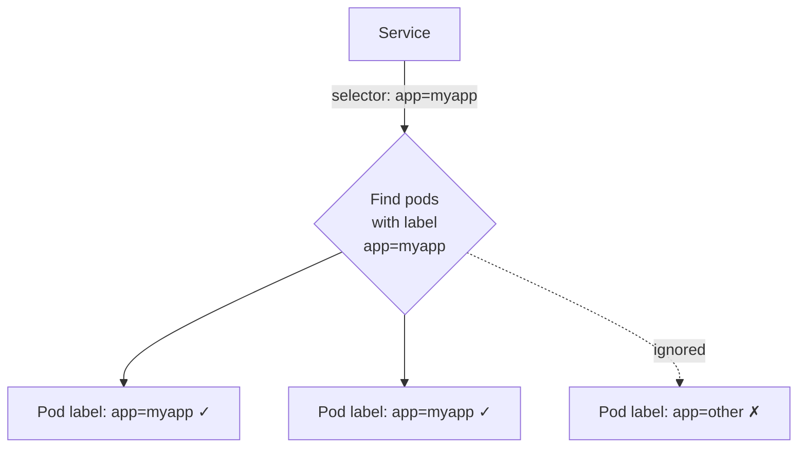
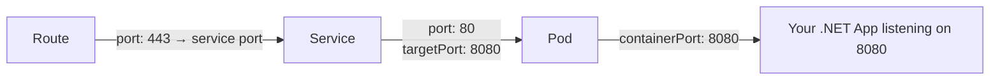
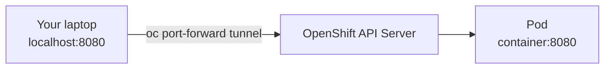
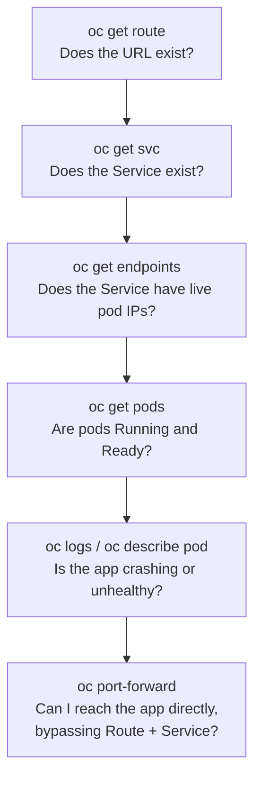

#para/resources/open-shift 

***

# 🤖❓Please give me a high level overview of Open Shift

## 🤖❓ 
- I am `c#` Software engineer with 30 years of experience and some experience using Pivotal Cloud Foundry.
- I am completely new to OpenShift and Kubernetes, although I get the overall concept.
- Please craft for me a high-level tutorial on OpenShift describing all of the primitives that I need to interact with in order to query it and understand the architecture and topology of the system.
- Please include for me as many Mermaid diagrams as you think necessary for me to understand how the different pieces connect to each other.
- Please create for me a cheat sheet of commands that I can run with the OC CLI tool in order to query my environment and understand what's going on in there.
	- Please explain to me port forwarding and how I might use it locally in order to debug my service.
	- Please explain to me how I understand what ports and HTTP endpoints my containers are exposing, and how I might get to them.
	- Please explain to me how an HTTP request gets from the outside world through Kubernetes and down to the service running inside my pod.
- Please ask me any questions if you need further explanation as to what I need explained to me.

# 🤖💡 
# OpenShift High-Level Overview for a PCF Veteran

Welcome! Since you know Cloud Foundry, I'll anchor several concepts back to PCF where it helps. The good news: your mental model of "push code, get a running, routable, scalable app" transfers directly. The difference is that OpenShift exposes the **building blocks** (Kubernetes primitives) much more explicitly than PCF did.

---

## 1. The Mental Model: PCF vs OpenShift/Kubernetes

| PCF Concept | OpenShift/K8s Equivalent | Notes |
|---|---|---|
| `cf push` | `oc new-app` / build + deploy | OpenShift can build from source (S2I) like PCF buildpacks |
| App instance | **Pod** | Smallest deployable unit |
| App (group of instances) | **Deployment** / **DeploymentConfig** | Manages replicas |
| Route | **Route** (OpenShift) / **Ingress** (K8s) | OpenShift Routes predate Ingress; very similar concept |
| Org / Space | **Project** (a Namespace with extras) | Isolation boundary |
| Service broker / marketplace | **Operators** / Service Catalog | How you get databases, etc. |
| Buildpack | **Source-to-Image (S2I)** | Turns source code into a container image |
| Droplet | **Container Image** | OCI image stored in a registry |
| `cf scale` | `oc scale` | Same idea |
| Diego cell | **Worker Node** | Where workloads run |

> **Key difference:** PCF hid Kubernetes-like machinery. OpenShift *is* Kubernetes (plus enterprise tooling, security, a web console, and Routes). You interact with declarative YAML objects stored in an API server's database (etcd).

---

## 2. The Core Primitives

Here's the hierarchy of objects you'll deal with daily.



### The primitives explained

- **Project / Namespace** — Your isolation boundary (like a PCF Space). Almost everything lives *inside* a project. A Project is OpenShift's wrapper around a Kubernetes Namespace with added access controls and annotations.
- **Pod** — One or more containers that share a network (same IP, same localhost) and storage. **This is the unit that "runs."** Usually one main container + optional sidecars. Pods are *ephemeral* — they get killed and recreated. Never rely on a pod's identity or IP being stable.
- **ReplicaSet** — Ensures *N* copies of a pod are running. You rarely touch this directly.
- **Deployment** (K8s) / **DeploymentConfig** (older OpenShift) — Declares the desired state: "run image X, 3 replicas, with these env vars." Handles rolling updates. **This is your "app."**
- **Service** — A *stable* virtual IP + DNS name that load-balances across the ever-changing set of pods. Because pods are ephemeral, you *never* talk to a pod directly in production — you talk to a Service. Think of it as an internal load balancer with a permanent address.
- **Route** — Exposes a Service to the *outside world* via a hostname (e.g. `myapp.apps.cluster.example.com`). This is OpenShift-specific and very close to a PCF Route.
- **ConfigMap** — Non-secret configuration (key/value or files) injected into pods as env vars or mounted files.
- **Secret** — Same as ConfigMap but for sensitive data (passwords, certs, tokens). Base64-encoded (note: *not* encrypted at rest by default).

---

## 3. How Traffic Flows From Outside to Your Code

This is the question that unlocks everything. Here's the full path:



**Step by step:**

1. **DNS** resolves `myapp.apps.cluster.example.com` to the cluster's **Router** (an HAProxy instance running on the cluster's ingress nodes). This is the equivalent of PCF's GoRouter.
2. The **Router** inspects the incoming hostname and matches it to a **Route** object you created.
3. The Route points at a **Service**.
4. The **Service** has a stable internal IP (`ClusterIP`) and a DNS name like `myservice.myproject.svc.cluster.local`. It load-balances across all healthy pods that match its **label selector**.
5. The Service forwards to a **target port** on one of the **Pods**.
6. Inside the pod, your **container** is listening on that port (e.g. your .NET app on `:8080`).

> **The label selector magic:** A Service doesn't hard-link to pods. It says "send traffic to any pod with label `app=myapp`." Pods get this label from the Deployment. This decoupling is why pods can come and go freely.



---

## 4. Understanding Ports

There are **three port concepts** that confuse newcomers. Let's nail them down:



| Term | Where defined | Meaning |
|---|---|---|
| `containerPort` | Pod/Container spec | The port your app *actually* listens on inside the container |
| `targetPort` | Service | Which container port the Service forwards to (should match `containerPort`) |
| `port` | Service | The port the Service exposes internally to other pods |
| Route target | Route | Which Service port external traffic hits |

**To discover what ports a container exposes:**

```bash
# See the ports declared in the pod spec
oc get pod <pod-name> -o jsonpath='{.spec.containers[*].ports}'

# See the service's port mapping
oc get svc <service-name> -o yaml
# look at .spec.ports[].port and .spec.ports[].targetPort

# Describe the route to see the external URL
oc get route
```

jj

---

## 5. Port Forwarding for Local Debugging

This is your best friend. `oc port-forward` creates a secure tunnel from a local port on your machine straight into a specific pod, **bypassing the Service and Route entirely**.



```bash
# Forward local port 8080 to port 8080 in the pod
oc port-forward pod/<pod-name> 8080:8080

# Forward to a service (picks a pod for you)
oc port-forward svc/<service-name> 8080:8080

# Map different local port (left) to container port (right)
oc port-forward pod/<pod-name> 9000:8080
```

Now hit `http://localhost:8080` in your browser/Postman and you're talking **directly to that pod**, skipping load balancing and routing. 

**Why this is invaluable:**
- Test a service that has *no* Route (internal-only services like databases).
- Connect a local SQL client to a database pod.
- Attach a remote debugger to your .NET app (if you expose the debug port).
- Isolate whether a problem is in your app or in the routing/Service layer.

---

## 6. OC CLI Cheat Sheet

### Login & Context

```bash
oc login --token=<token> --server=https://api.cluster.com:6443
oc whoami                          # who am I logged in as
oc projects                        # list projects I can see
oc project <name>                  # switch active project (like cf target -s)
oc status                          # high-level overview of current project
```

### Discovery — "What's running here?"

```bash
oc get all                         # pods, services, deployments, routes in one shot
oc get pods                        # list pods
oc get pods -o wide                # + node and IP info
oc get deployments                 # your "apps"
oc get svc                         # services
oc get routes                      # external URLs
oc get configmaps
oc get secrets
oc get events --sort-by=.lastTimestamp   # recent cluster events (debugging gold)
```

### Deep Inspection

```bash
oc describe pod <pod>              # full detail: events, env, mounts, status
oc describe svc <service>          # selector, ports, endpoints
oc get pod <pod> -o yaml          # the raw object
oc explain pod.spec.containers     # built-in schema docs (very handy!)
```

### Logs & Live Debugging

```bash
oc logs <pod>                      # stdout/stderr of the pod
oc logs <pod> -c <container>       # specific container in a multi-container pod
oc logs -f <pod>                   # follow (tail -f)
oc logs <pod> --previous           # logs from the *crashed* previous instance
oc exec <pod> -- ls /app           # run a command inside
oc rsh <pod>                       # interactive shell inside the pod (like cf ssh)
oc cp <pod>:/path/file ./file      # copy files out of a pod
```

### Networking / Routing

```bash
oc get endpoints <service>         # which pod IPs the service is actually routing to
oc port-forward svc/<service> 8080:8080
oc expose svc/<service>            # quickly create a Route for a Service
```

> 💡 **`oc get endpoints` is the #1 troubleshooting command.** If a Service has *no* endpoints, its label selector isn't matching any healthy pods — that's why "the route returns 503." Always check this.

### Scaling & Lifecycle

```bash
oc scale deployment/<name> --replicas=3
oc rollout status deployment/<name>
oc rollout restart deployment/<name>     # bounce all pods
oc rollout undo deployment/<name>        # roll back
oc delete pod <pod>                      # K8s recreates it (test resilience!)
```

### Deploying

```bash
oc new-app https://github.com/me/myrepo  # S2I build from source (buildpack-like)
oc new-app --image=myregistry/myimage    # deploy an existing image
oc apply -f manifest.yaml                # declarative apply (GitOps style)
```

---

## 7. A Typical Debugging Workflow

When "my service isn't responding," walk *down* the chain:



This top-down-then-direct approach isolates *which layer* is broken: routing, service selection, pod health, or the app itself.

---

## 8. Two Things That Will Bite You Coming From PCF

1. **Readiness probes matter.** A pod can be "Running" but not "Ready." If your readiness probe fails, the Service removes the pod from its endpoints and traffic stops — even though the pod looks alive. Check `oc describe pod` for probe failures.
2. **Everything is declarative.** Unlike `cf push` (imperative), OpenShift continuously reconciles *desired state* (your YAML) against *actual state*. Delete a pod and it comes back. To truly stop an app, scale the Deployment to 0 or delete the Deployment.

---

## Questions for You

To tailor a deeper dive, could you tell me:

1. **Are you deploying from source** (S2I, like buildpacks) or **pre-built container images** (e.g. from a CI pipeline producing a Docker image)? This changes the build story significantly.
2. **Do you need stateful services** (databases, message queues) inside OpenShift, or will those be external? This affects whether you'll touch Operators, StatefulSets, and PersistentVolumes.
3. **GitOps?** Is your team using ArgoCD/Helm/raw YAML, or are you mostly using the web console + `oc` imperatively right now?
4. **Remote debugging** — do you want me to show how to attach the .NET debugger to a running pod over `port-forward`?

Answer those and I'll go a layer deeper on whichever area matters most to your day-to-day.
