***

# 🤖❓Please give me a high level overview of Open Shift

## 🤖❓ 
- I am `c#` Software engineer with 30 years of experience and some experience using Pivotal Cloud Foundry.
- I am completely new to OpenShift and Kubernetes, although I get the overall concept.
- Please craft for me a high-level tutorial on OpenShift describing all of the primitives that I need to interact with in order to query it and understand the architecture and topology of the system.
- Please include for me as many Mermaid diagrams as you think necessary for me to understand how the different pieces connect to each other.
- Please create for me a cheat sheet of commands that I can run with the OC CLI tool in order to query my environment and understand what's going on in there.
	- Please explain to me port forwarding and how I might use it locally in order to debug my service.
	- Please explain to me how I understand what ports and HTTP endpoints my containers are exposing, and how I might get to them.
	- Please explain to me how an HTTP request gets from the outside world through Kubernetes and down to the service running inside my pod.
- Please ask me any questions if you need further explanation as to what I need explained to me.

# 🤖💡OpenShift High-Level Overview for a PCF Veteran

Welcome! Since you know Cloud Foundry, I'll anchor several concepts back to PCF where it helps. The good news: your mental model of "push code, get a running, routable, scalable app" transfers directly. The difference is that OpenShift exposes the **building blocks** (Kubernetes primitives) much more explicitly than PCF did.

---

## 1. The Mental Model: PCF vs OpenShift/Kubernetes

| PCF Concept                  | OpenShift/K8s Equivalent                  | Notes                                                     |
| ---------------------------- | ----------------------------------------- | --------------------------------------------------------- |
| `cf push`                    | `oc new-app` / build + deploy             | OpenShift can build from source (S2I) like PCF buildpacks |
| App instance                 | **Pod**                                   | Smallest deployable unit                                  |
| App (group of instances)     | **Deployment** / **DeploymentConfig**     | Manages replicas                                          |
| Route                        | **Route** (OpenShift) / **Ingress** (K8s) | OpenShift Routes predate Ingress; very similar concept    |
| Org / Space                  | **Project** (a Namespace with extras)     | Isolation boundary                                        |
| Service broker / marketplace | **Operators** / Service Catalog           | How you get databases, etc.                               |
| Buildpack                    | **Source-to-Image (S2I)**                 | Turns source code into a container image                  |
| Droplet                      | **Container Image**                       | OCI image stored in a registry                            |
| `cf scale`                   | `oc scale`                                | Same idea                                                 |
| Diego cell                   | **Worker Node**                           | Where workloads run                                       |

> **Key difference:** PCF hid Kubernetes-like machinery. OpenShift *is* Kubernetes (plus enterprise tooling, security, a web console, and Routes). You interact with declarative YAML objects stored in an API server's database (etcd).

---

## 2. The Core Primitives

Here's the hierarchy of objects you'll deal with daily.

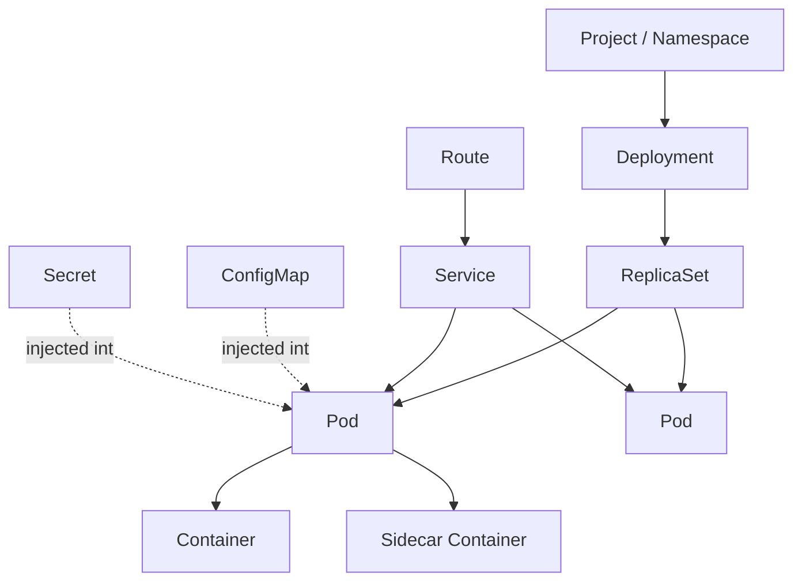

### The primitives explained

- **Project / Namespace** — Your isolation boundary (like a PCF Space). Almost everything lives *inside* a project. A Project is OpenShift's wrapper around a Kubernetes Namespace with added access controls and annotations.
- **Pod** — One or more containers that share a network (same IP, same localhost) and storage. **This is the unit that "runs."** Usually one main container + optional sidecars. Pods are *ephemeral* — they get killed and recreated. Never rely on a pod's identity or IP being stable.
- **ReplicaSet** — Ensures *N* copies of a pod are running. You rarely touch this directly.
- **Deployment** (K8s) / **DeploymentConfig** (older OpenShift) — Declares the desired state: "run image X, 3 replicas, with these env vars." Handles rolling updates. **This is your "app."**
- **Service** — A *stable* virtual IP + DNS name that load-balances across the ever-changing set of pods. Because pods are ephemeral, you *never* talk to a pod directly in production — you talk to a Service. Think of it as an internal load balancer with a permanent address.
- **Route** — Exposes a Service to the *outside world* via a hostname (e.g. `myapp.apps.cluster.example.com`). This is OpenShift-specific and very close to a PCF Route.
- **ConfigMap** — Non-secret configuration (key/value or files) injected into pods as env vars or mounted files.
- **Secret** — Same as ConfigMap but for sensitive data (passwords, certs, tokens). Base64-encoded (note: *not* encrypted at rest by default).

---

## 3. How Traffic Flows From Outside to Your Code

This is the question that unlocks everything. Here's the full path:

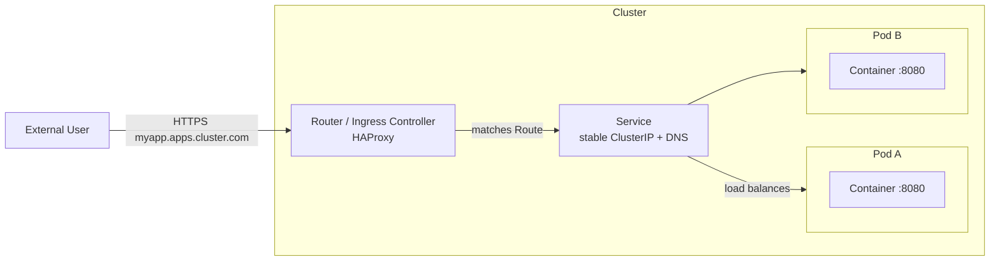

**Step by step:**

1. **DNS** resolves `myapp.apps.cluster.example.com` to the cluster's **Router** (an HAProxy instance running on the cluster's ingress nodes). This is the equivalent of PCF's GoRouter.
2. The **Router** inspects the incoming hostname and matches it to a **Route** object you created.
3. The Route points at a **Service**.
4. The **Service** has a stable internal IP (`ClusterIP`) and a DNS name like `myservice.myproject.svc.cluster.local`. It load-balances across all healthy pods that match its **label selector**.
5. The Service forwards to a **target port** on one of the **Pods**.
6. Inside the pod, your **container** is listening on that port (e.g. your .NET app on `:8080`).

> **The label selector magic:** A Service doesn't hard-link to pods. It says "send traffic to any pod with label `app=myapp`." Pods get this label from the Deployment. This decoupling is why pods can come and go freely.

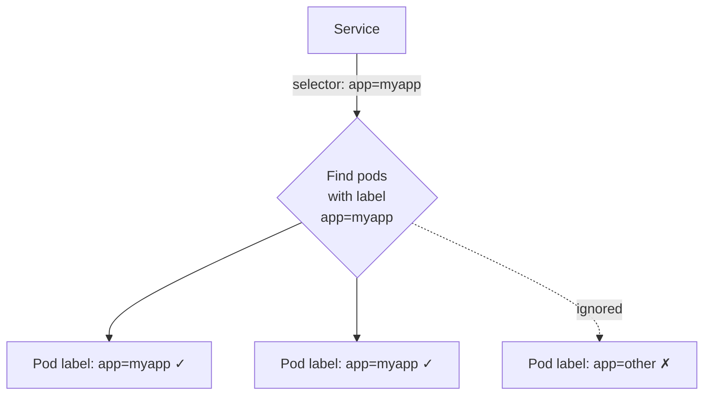

---

## 4. Understanding Ports

There are **three port concepts** that confuse newcomers. Let's nail them down:

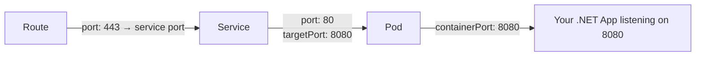

| Term | Where defined | Meaning |
|---|---|---|
| `containerPort` | Pod/Container spec | The port your app *actually* listens on inside the container |
| `targetPort` | Service | Which container port the Service forwards to (should match `containerPort`) |
| `port` | Service | The port the Service exposes internally to other pods |
| Route target | Route | Which Service port external traffic hits |

**To discover what ports a container exposes:**

```bash
# See the ports declared in the pod spec
oc get pod <pod-name> -o jsonpath='{.spec.containers[*].ports}'

# See the service's port mapping
oc get svc <service-name> -o yaml
# look at .spec.ports[].port and .spec.ports[].targetPort

# Describe the route to see the external URL
oc get route
```

---

## 5. Port Forwarding for Local Debugging

This is your best friend. `oc port-forward` creates a secure tunnel from a local port on your machine straight into a specific pod, **bypassing the Service and Route entirely**.

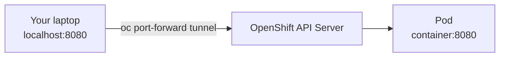

```bash
# Forward local port 8080 to port 8080 in the pod
oc port-forward pod/<pod-name> 8080:8080

# Forward to a service (picks a pod for you)
oc port-forward svc/<service-name> 8080:8080

# Map different local port (left) to container port (right)
oc port-forward pod/<pod-name> 9000:8080
```

Now hit `http://localhost:8080` in your browser/Postman and you're talking **directly to that pod**, skipping load balancing and routing. 

**Why this is invaluable:**
- Test a service that has *no* Route (internal-only services like databases).
- Connect a local SQL client to a database pod.
- Attach a remote debugger to your .NET app (if you expose the debug port).
- Isolate whether a problem is in your app or in the routing/Service layer.

---

## 6. OC CLI Cheat Sheet

### Login & Context

```bash
oc login --token=<token> --server=https://api.cluster.com:6443
oc whoami                          # who am I logged in as
oc projects                        # list projects I can see
oc project <name>                  # switch active project (like cf target -s)
oc status                          # high-level overview of current project
```

### Discovery — "What's running here?"

```bash
oc get all                         # pods, services, deployments, routes in one shot
oc get pods                        # list pods
oc get pods -o wide                # + node and IP info
oc get deployments                 # your "apps"
oc get svc                         # services
oc get routes                      # external URLs
oc get configmaps
oc get secrets
oc get events --sort-by=.lastTimestamp   # recent cluster events (debugging gold)
```

### Deep Inspection

```bash
oc describe pod <pod>              # full detail: events, env, mounts, status
oc describe svc <service>          # selector, ports, endpoints
oc get pod <pod> -o yaml           # the raw object
oc explain pod.spec.containers     # built-in schema docs (very handy!)
```

### Logs & Live Debugging

```bash
oc logs <pod>                      # stdout/stderr of the pod
oc logs <pod> -c <container>       # specific container in a multi-container pod
oc logs -f <pod>                   # follow (tail -f)
oc logs <pod> --previous           # logs from the *crashed* previous instance
oc exec <pod> -- ls /app           # run a command inside
oc rsh <pod>                       # interactive shell inside the pod (like cf ssh)
oc cp <pod>:/path/file ./file      # copy files out of a pod
```

### Networking / Routing

```bash
oc get endpoints <service>         # which pod IPs the service is actually routing to
oc port-forward svc/<service> 8080:8080
oc expose svc/<service>            # quickly create a Route for a Service
```

> 💡 **`oc get endpoints` is the #1 troubleshooting command.** If a Service has *no* endpoints, its label selector isn't matching any healthy pods — that's why "the route returns 503." Always check this.

### Scaling & Lifecycle

```bash
oc scale deployment/<name> --replicas=3
oc rollout status deployment/<name>
oc rollout restart deployment/<name>     # bounce all pods
oc rollout undo deployment/<name>        # roll back
oc delete pod <pod>                      # K8s recreates it (test resilience!)
```

### Deploying

```bash
oc new-app https://github.com/me/myrepo  # S2I build from source (buildpack-like)
oc new-app --image=myregistry/myimage    # deploy an existing image
oc apply -f manifest.yaml                # declarative apply (GitOps style)
```

---

## 7. A Typical Debugging Workflow

When "my service isn't responding," walk *down* the chain:

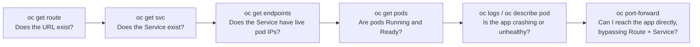

This left-right-then-direct approach isolates *which layer* is broken: routing, service selection, pod health, or the app itself.

---

## 8. Two Things That Will Bite You Coming From PCF

1. **Readiness probes matter.** A pod can be "Running" but not "Ready." If your readiness probe fails, the Service removes the pod from its endpoints and traffic stops — even though the pod looks alive. Check `oc describe pod` for probe failures.
2. **Everything is declarative.** Unlike `cf push` (imperative), OpenShift continuously reconciles *desired state* (your YAML) against *actual state*. Delete a pod and it comes back. To truly stop an app, scale the Deployment to 0 or delete the Deployment.

---

## 🤖💬❓Questions for You

To tailor a deeper dive, could you tell me:

1. **Are you deploying from source** (S2I, like buildpacks) or **pre-built container images** (e.g. from a CI pipeline producing a Docker image)? This changes the build story significantly.

> We are deploying from pre-built container images 

1. **Do you need stateful services** (databases, message queues) inside OpenShift, or will those be external? This affects whether you'll touch Operators, StatefulSets, and PersistentVolumes.

> Not sure, please elaborate on them

1. **GitOps?** Is your team using ArgoCD/Helm/raw YAML, or are you mostly using the web console + `oc` imperatively right now?

> We are using Harness

1. **Remote debugging** — do you want me to show how to attach the .NET debugger to a running pod over `port-forward`?

> Yes please!

Answer those and I'll go a layer deeper on whichever area matters most to your day-to-day.

## 🤖💡 Great answers 
Let me go deeper on the three areas you flagged: **stateful services**, **Harness-based deployment of pre-built images**, and **remote .NET debugging over port-forward**. I'll keep anchoring back to your PCF/C# background.

---

### Part A: Stateful Services — Do You Need Them Inside OpenShift?

First, the core question: **does your workload need to remember anything between pod restarts?**

Remember pods are *ephemeral*. When a pod dies, anything written to its local filesystem is **gone**. For a stateless .NET API this is fine — it reads config, serves requests, holds nothing. But databases, message brokers, and file stores *must* survive restarts. That's what the stateful primitives solve.

#### The decision tree

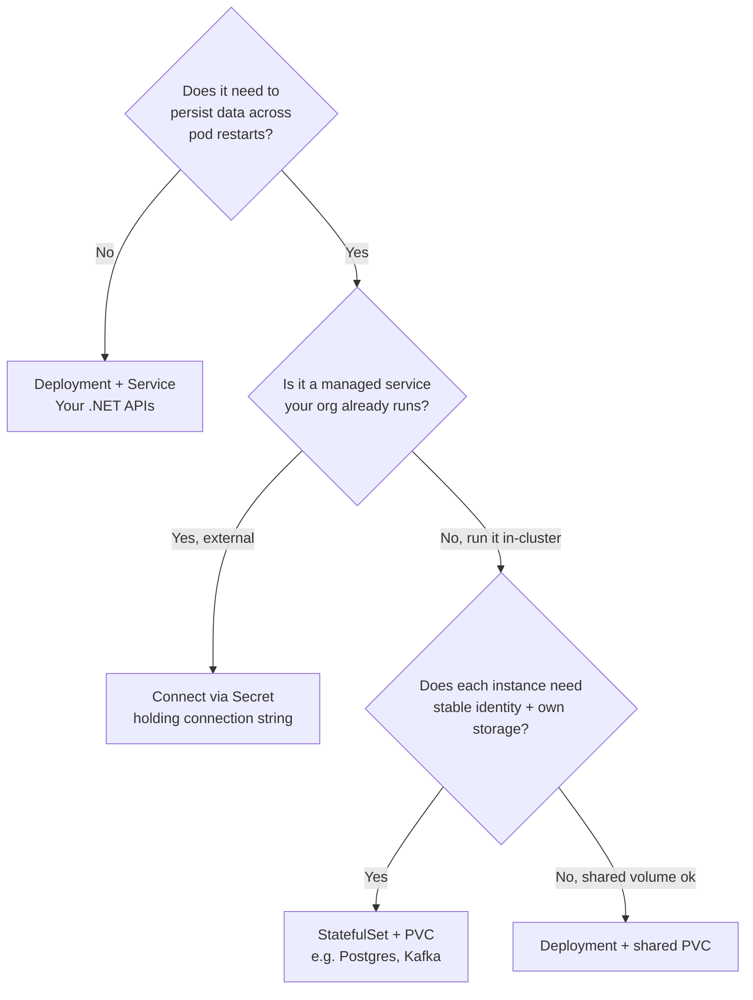

#### My strong recommendation for you

**For your first OpenShift project, keep databases and queues EXTERNAL.** Run your stateless .NET services in OpenShift, and connect them to existing managed databases (Azure SQL, RDS, an on-prem cluster, etc.) via connection strings stored in **Secrets**. Stateful workloads in Kubernetes are an advanced topic with real operational burden (backups, failover, storage provisioning). Don't take that on while also learning the platform.

That said, here are the primitives so you recognize them:

#### The stateful primitives

| Primitive | What it does | PCF analogy |
|---|---|---|
| **PersistentVolume (PV)** | A piece of actual storage in the cluster (a disk, NFS share, cloud volume) | A bound disk |
| **PersistentVolumeClaim (PVC)** | A *request* for storage ("I need 10Gi"). The pod mounts the PVC, the cluster binds it to a PV | Asking the platform for a volume service |
| **StorageClass** | A template defining *how* to provision storage dynamically (which backend, fast SSD vs slow) | The "plan" of a storage service |
| **StatefulSet** | Like a Deployment, but each pod gets a **stable name** (`db-0`, `db-1`) and its **own PVC** | No clean analogy — PCF hid this |

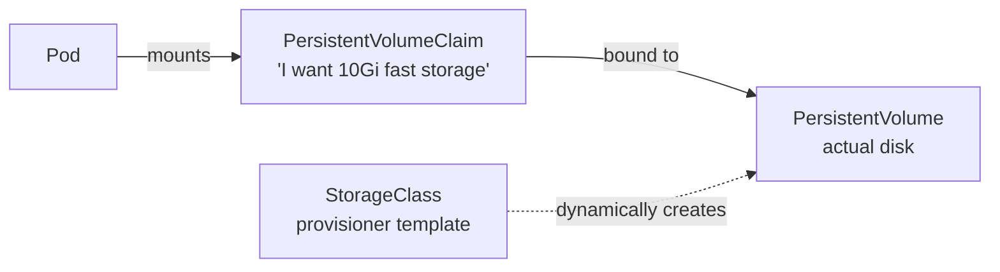

**Why StatefulSet instead of Deployment for databases?** In a Deployment, all pods are interchangeable clones. A database cluster can't work that way — `node-0` is the primary, `node-1` is a replica, each owns a *specific* slice of data on a *specific* disk. StatefulSet guarantees stable network identity (`db-0.db.myproject.svc.cluster.local`) and sticky storage so a restarted pod reattaches to *its* data.

#### How you'd connect a .NET app to an external database

```bash
# Create a secret holding the connection string
oc create secret generic db-conn \
  --from-literal=ConnectionStrings__Default="Server=mydb.example.com;Database=app;User Id=svc;Password=..."
```

Then in your Deployment YAML, inject it as an env var:

```yaml
spec:
  containers:
    - name: myapi
      image: myregistry/myapi:1.4.2
      envFrom:
        - secretRef:
            name: db-conn
```

Your .NET `IConfiguration` picks up `ConnectionStrings__Default` automatically (the `__` maps to the `:` hierarchy). This is the clean, idiomatic pattern.

> **Operators** (you saw them in the table earlier): if you *did* want a production-grade in-cluster Postgres, you'd install something like the **CloudNativePG Operator**. An Operator is essentially "a database admin encoded as software" — it watches custom objects you create (e.g. a `Cluster` object) and handles provisioning, failover, and backups for you. It's the closest thing to a PCF service broker. But again — later.

---

### Part B: Deploying Pre-Built Images with Harness

Since you're using pre-built images and Harness, **you skip the entire S2I/build story.** Your world is simpler: Harness pushes an image to a registry, then tells OpenShift to run it. Here's the flow:

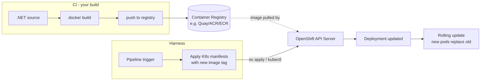

#### What you actually own

With Harness driving deployment, **you own the YAML manifests** (or Helm charts) describing your Deployment, Service, Route, ConfigMap, and Secret references. Harness mostly does three things:

1. **Authenticates** to your OpenShift cluster (using a service account token / kubeconfig stored in Harness).
2. **Templates the image tag** — it swaps `myimage:OLD` for `myimage:NEW_BUILD_ID` in your manifest.
3. **Applies** the manifest (`oc apply -f` under the hood) and **watches the rollout** until pods are Ready.

#### The rolling update — what happens when Harness deploys

This is important to understand because it's where "my deploy succeeded but the app is broken" bugs live:

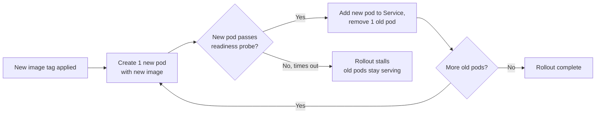

**Key insight for you:** if your **readiness probe** is wrong or your app is slow to start, the rollout *stalls* but your old version keeps serving traffic. This is a safety feature, but it surprises people. Harness will report the deploy as failed/timed out. Your debugging command:

```bash
oc rollout status deployment/<name>     # is it stuck?
oc get pods                             # see old + new pods coexisting
oc describe pod <new-pod>               # why won't the new one go Ready?
```

#### A minimal manifest set you'd hand to Harness

You'll typically have these in your repo. Here's the skeleton so you recognize the pieces:

```yaml
# deployment.yaml
apiVersion: apps/v1
kind: Deployment
metadata:
  name: myapi
spec:
  replicas: 3
  selector:
    matchLabels:
      app: myapi              # <-- Service finds pods via this label
  template:
    metadata:
      labels:
        app: myapi            # <-- pods stamped with this label
    spec:
      containers:
        - name: myapi
          image: myregistry/myapi:GIT_SHA   # <-- Harness rewrites this tag
          ports:
            - containerPort: 8080           # <-- where your .NET app listens
          envFrom:
            - secretRef:
                name: db-conn
          readinessProbe:
            httpGet:
              path: /health/ready
              port: 8080
            initialDelaySeconds: 5
            periodSeconds: 10
          livenessProbe:
            httpGet:
              path: /health/live
              port: 8080
            initialDelaySeconds: 15
            periodSeconds: 20
---
# service.yaml
apiVersion: v1
kind: Service
metadata:
  name: myapi
spec:
  selector:
    app: myapi              # <-- must match the pod label above
  ports:
    - port: 80              # internal port other pods/route hit
      targetPort: 8080      # <-- forwards to containerPort
---
# route.yaml (OpenShift-specific)
apiVersion: route.openshift.io/v1
kind: Route
metadata:
  name: myapi
spec:
  to:
    kind: Service
    name: myapi
  port:
    targetPort: 8080
  tls:
    termination: edge       # HTTPS terminated at the router
```

> **Liveness vs Readiness** — these matter enormously and PCF mostly hid them:
> - **Readiness probe**: "Should I receive traffic *right now*?" Fail → removed from Service endpoints, no traffic, but pod keeps running. Use for "still warming up" or "lost DB connection temporarily."
> - **Liveness probe**: "Am I fundamentally broken?" Fail → pod is **killed and restarted**. Use sparingly — a too-aggressive liveness probe causes restart loops.
> 
> Map these to dedicated ASP.NET Core health check endpoints (`AddHealthChecks().AddCheck(...)` with `/health/ready` and `/health/live`).

---

### Part C: Remote .NET Debugging Over Port-Forward

Yes! This is genuinely useful. The strategy: get `vsdbg` (the .NET debugger backend) running *inside* the pod, then connect your local VS/VS Code/Rider to it. There are two approaches.

#### Approach 1: Attach over `oc exec` (cleanest, no port-forward needed)

Modern tooling can launch the debugger *through* `oc exec` directly — no port to forward. VS Code's `.NET attach` and Rider both support this. Conceptually:

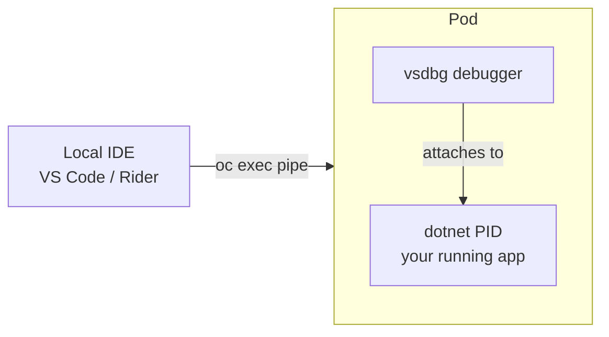

**Prerequisites in your image (or installed on the fly):**
- `vsdbg` must be present in the container. Either bake it into a debug image variant, or install it at debug time:

```bash
# Get a shell into the running pod
oc rsh <pod-name>

# Inside the pod — install vsdbg (needs curl/bash + write access)
curl -sSL https://aka.ms/getvsdbgsh | bash /dev/stdin -v latest -l /vsdbg
```

> ⚠️ Your production image is probably minimal (no curl, read-only filesystem, non-root). That's good security but blocks this. For debugging, build a **debug-flavored image** that includes `vsdbg` and the PDB symbol files, and deploy *that* to a non-prod namespace.

**VS Code `launch.json` to attach through oc:**

```json
{
  "name": ".NET Attach to OpenShift Pod",
  "type": "coreclr",
  "request": "attach",
  "processId": "${command:pickRemoteProcess}",
  "pipeTransport": {
    "pipeProgram": "oc",
    "pipeArgs": ["rsh", "<pod-name>"],
    "debuggerPath": "/vsdbg/vsdbg",
    "quoteArgs": false
  },
  "sourceFileMap": {
    "/app": "${workspaceFolder}"
  }
}
```

The `sourceFileMap` is critical: it tells the debugger "the `/app` paths the running binary knows about correspond to *this* folder on my laptop," so breakpoints line up with your local source.

#### Approach 2: Classic port-forward to a debug port

If your debugger speaks over a TCP port (some setups, or remote SSH-style debugging), you expose that port and tunnel it:

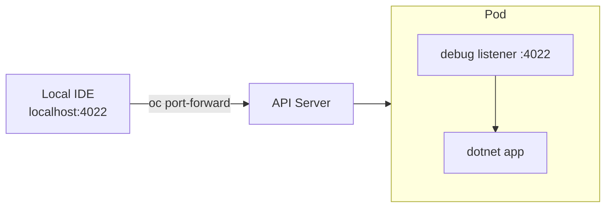

```bash
oc port-forward pod/<pod-name> 4022:4022
# Now point your IDE's remote debug config at localhost:4022
```

#### The pragmatic reality + my recommendation

Remote-attaching a .NET debugger inside Kubernetes is **fiddly** — symbol mismatches, missing vsdbg, security policies blocking it. In practice, most experienced teams reach for these *first*:

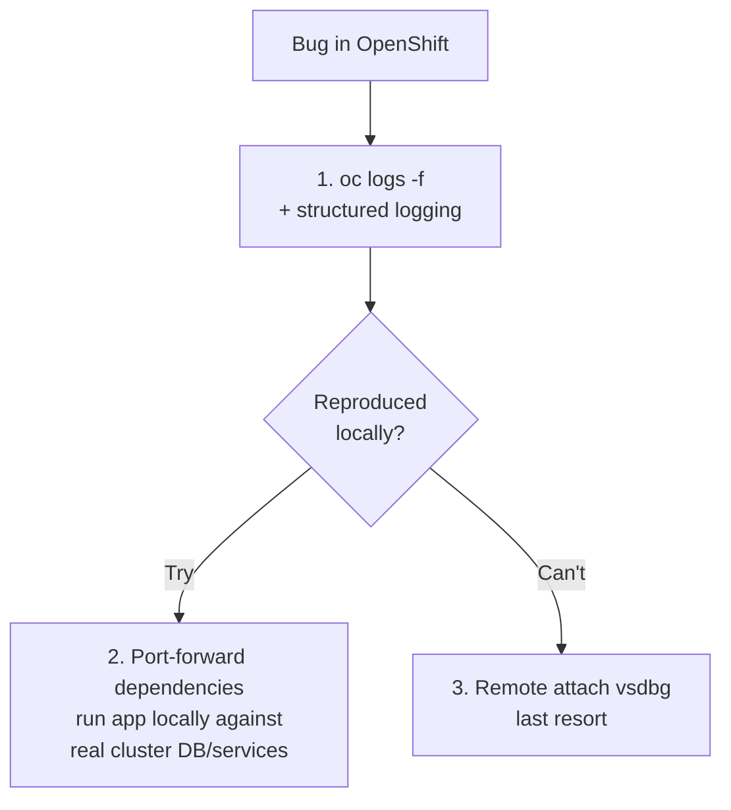

**The middle option is gold for you:** use `oc port-forward` to tunnel the *dependencies* (database, downstream service) to your laptop, then run your .NET app **locally in your normal debugger** pointing at those forwarded ports. You get your full local debugging experience while talking to real cluster data:

```bash
# Tunnel the cluster database to localhost
oc port-forward svc/postgres 5432:5432

# Now run your app locally with a connection string pointing at localhost:5432
# Full breakpoints, hot reload, the works — no vsdbg-in-pod headache.
```

This sidesteps almost all the pain and matches the dev loop you already know.

---

### Updated Cheat Sheet

# 🤖💡 
You've already got a thorough, well-structured document here. It looks essentially complete — you've covered the overview, primitives, traffic flow, ports, port-forwarding, the CLI cheat sheet, debugging workflow, and then the deeper dive on stateful services, Harness deployment, and .NET remote debugging.

The document trails off at the very end with **"### Updated Cheat Sheet"** as a dangling header. Let me complete that section for you, plus flag a couple of small cleanups.

---

## Updated Cheat Sheet — Stateful, Deployment & Debugging Additions

```bash
# --- Storage / Stateful ---
oc get pvc                              # persistent volume claims in project
oc get pv                               # cluster-wide persistent volumes
oc get storageclass                     # available storage provisioners
oc describe pvc <name>                  # is it Bound? to which PV?
oc get statefulset                      # list statefulsets
oc get pods -l app=postgres             # pods by label (see db-0, db-1...)

# --- Secrets / Config for DB connections ---
oc create secret generic db-conn \
  --from-literal=ConnectionStrings__Default="Server=...;Password=..."
oc get secret db-conn -o jsonpath='{.data.ConnectionStrings__Default}' | base64 -d
oc set env deployment/myapi --from=secret/db-conn   # inject all secret keys as env

# --- Deployment / Rollout (Harness troubleshooting) ---
oc rollout status deployment/myapi      # is the deploy stuck?
oc rollout history deployment/myapi     # past revisions
oc rollout undo deployment/myapi        # roll back to previous
oc get pods -w                          # watch pods swap during rolling update
oc get deployment myapi -o jsonpath='{.spec.template.spec.containers[0].image}'  # current image tag

# --- Probes / Readiness debugging ---
oc describe pod <pod> | grep -A5 -i readiness   # see probe config & failures
oc get pods                              # READY column: 0/1 means not passing readiness

# --- Remote debugging ---
oc rsh <pod>                            # shell into pod
oc port-forward svc/postgres 5432:5432  # tunnel a dependency to localhost
oc port-forward pod/<pod> 4022:4022     # tunnel a debug port
```

---

## Summary Diagram

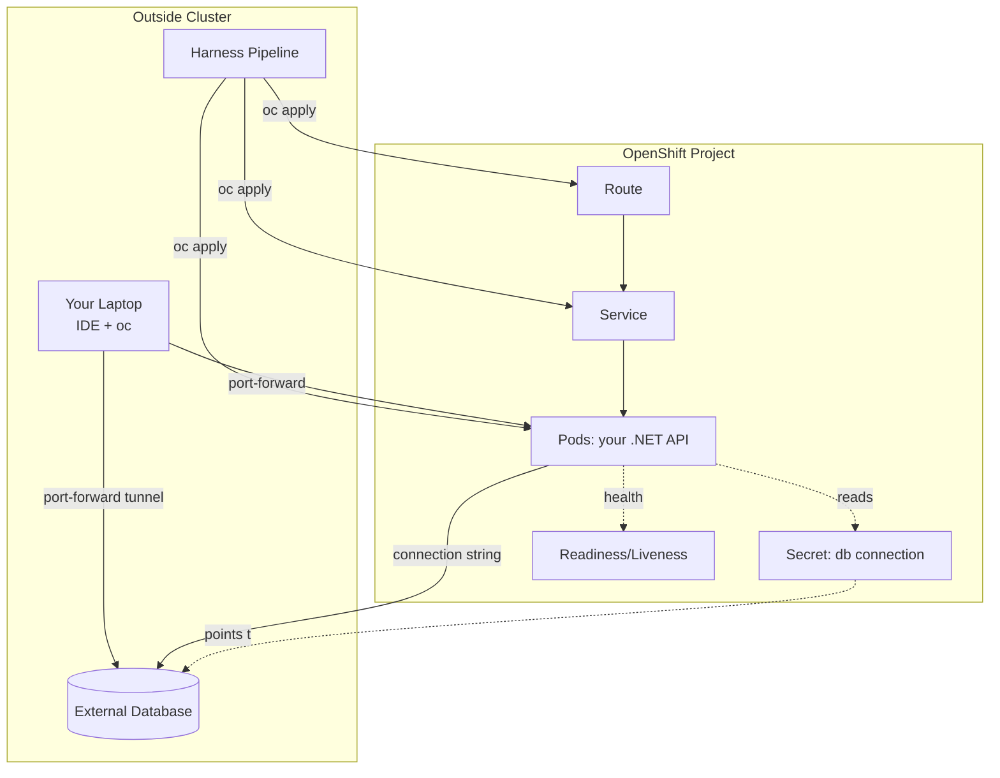

---

Is there a **specific section you'd like me to expand further** — for example:

- A complete, production-ready Helm chart or Kustomize layout for your .NET service?
- How Harness specifically wires up its OpenShift connector and delegate (the auth/networking side)?
- ASP.NET Core health check code to back those readiness/liveness probes?
- RBAC and ServiceAccounts (what permissions your pods and your Harness deployer actually need)?

Let me know which direction is most useful and I'll go deep.
