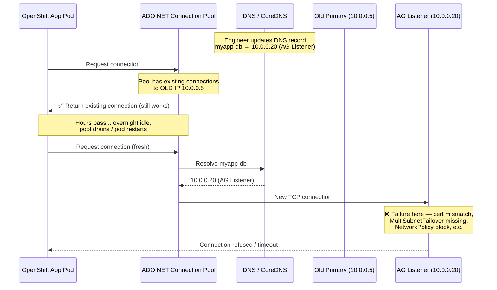
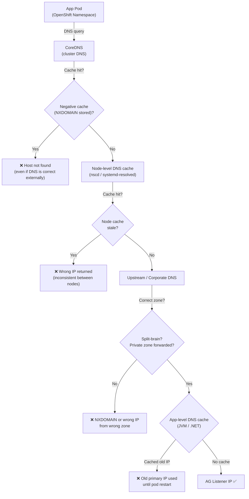
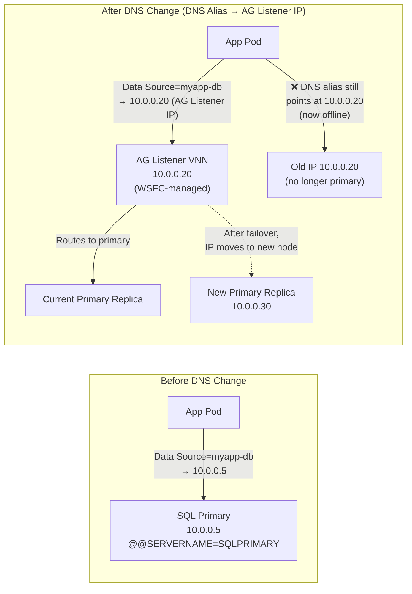
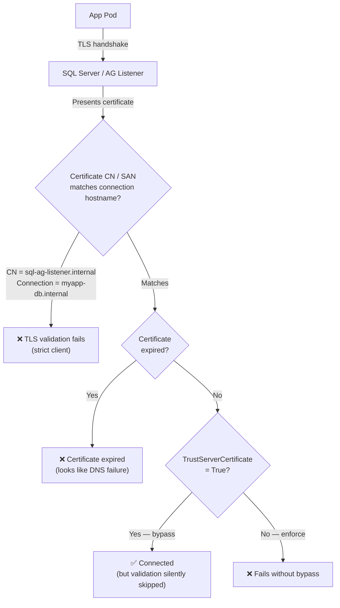
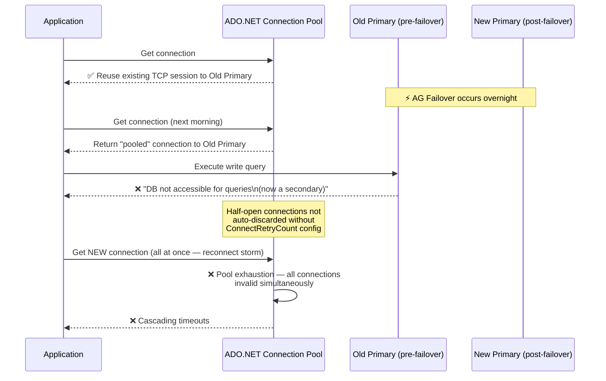
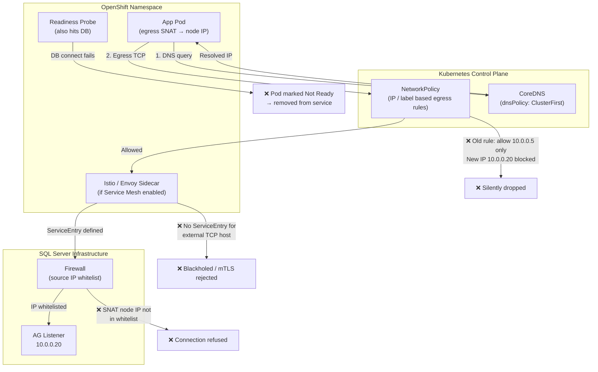
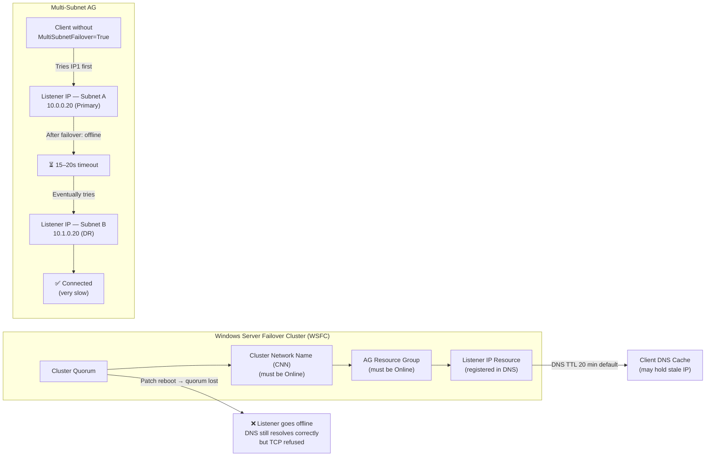
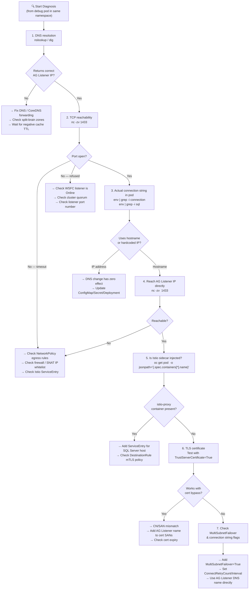
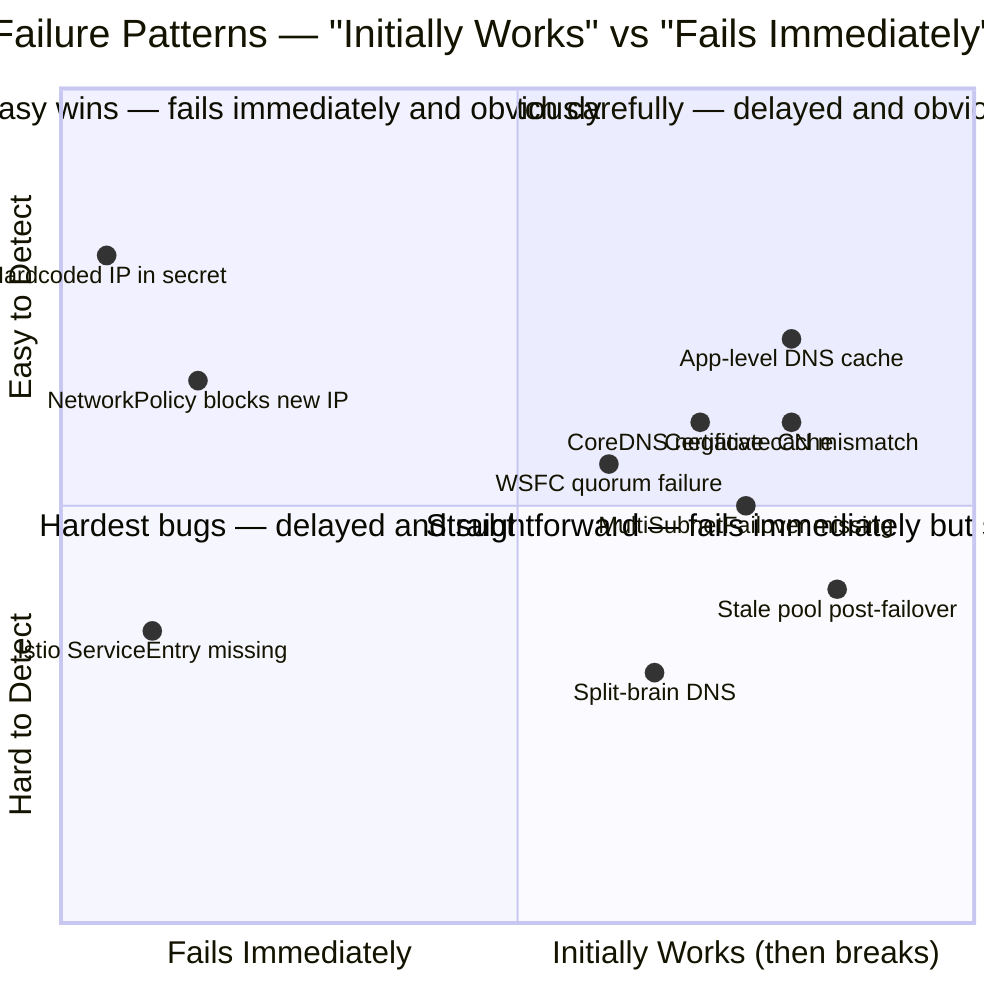

# 🤖❓ SQL Server HA Failover DNS Redirection — What Can Go Wrong in OpenShift

## 🗺️ Background — What You Tried

You had an app running in an OpenShift pod pointing at a primary SQL Server instance via a DNS hostname. To migrate to an Always On Availability Group (AG), an engineer updated the DNS record so the existing hostname now resolved to the AG Listener endpoint instead of the standalone primary.

It **appeared to work initially**, then **broke the next day**.

This document is a detailed post-mortem of every layer that can fail with this approach.

---

## 🧠 Why It "Initially Worked Then Broke"

This is the classic signature of a **DNS TTL + connection pool interaction**:

1. The DNS update propagates — new connections resolve to the AG Listener IP ✅
2. Existing connections in the ADO.NET/ODBC connection pool are **reused** (they still point at the old primary IP) ✅ for now
3. Overnight, the app is idle, the pool drains, or a pod restarts
4. The next morning, **new connections are opened** — but now something is different (failover happened, certificate mismatch, AG listener quirk) ❌

This timing pattern rules out a simple typo and points to a **state transition** — something that only manifests on a fresh connection.



---

## 🔴 Category 1 — DNS and Name Resolution Issues



### 1.1 CoreDNS / kube-dns Negative Caching

OpenShift uses CoreDNS. It caches DNS responses including **negative responses** (NXDOMAIN). If the DNS update briefly returned no result during propagation, CoreDNS may have cached the failure. The TTL for negative cache entries can outlive your expectation of "DNS has updated."

**Symptom:** Connections fail with "host not found" even though the DNS record is correct outside the cluster.

### 1.2 Node-Level DNS Cache (nscd / systemd-resolved)

OpenShift worker nodes may run `nscd` or `systemd-resolved` which maintain their **own independent TTL-based cache**. The cluster DNS layer (CoreDNS) sits on top of this. A record change must expire at **both** layers before pods see the new IP.

**Symptom:** Inconsistent behaviour between pods on different nodes — some connect, others don't.

### 1.3 Java / .NET / Application-Level DNS Caching

The JVM has a [security property `networkaddress.cache.ttl`](https://docs.oracle.com/javase/8/docs/technotes/guides/net/properties.html) that defaults to **cache-forever** for security reasons. .NET has historically cached DNS for ~30 seconds via `ServicePoint`, though modern `HttpClient`/`SqlConnection` behaviour varies.

If your connection string uses `SqlConnection` with a hostname, the **driver** may cache the IP resolved at first use and never re-resolve — even if DNS changes.

**Symptom:** Works after a pod restart (cache is cold), breaks again within minutes.

### 1.4 Split-Brain DNS — Internal vs. External Resolution

The AG Listener DNS name may be registered in an on-premise or Azure private DNS zone that is **not forwarded correctly** from OpenShift's CoreDNS. The initial success may have come from a cached entry from before the change. Once that expired, CoreDNS attempted to resolve fresh and hit the wrong zone or got no answer.

**Symptom:** `nslookup <ag-listener>` from inside a debug pod returns NXDOMAIN or the wrong IP.

---

## 🔴 Category 2 — SQL Server Always On AG Listener Behaviour



### 2.1 AG Listener Is Not the Same as a Primary Server DNS Alias

A standalone SQL Server primary responds to connections on port 1433 and identifies itself with the server's `@@SERVERNAME`. An AG Listener is a **virtual network name (VNN)** backed by a Windows Cluster resource. It:

- Has its own IP and port (may differ from 1433)
- Routes only to the **current primary replica**
- Requires the Windows Failover Cluster service to be healthy to respond
- May require `MultiSubnetFailover=True` in the connection string for multi-subnet AGs

Pointing a DNS alias at the AG Listener IP **bypasses the VNN entirely** — the cluster doesn't know the connection is coming through your alias, it just sees a TCP connection to its IP.

**What can go wrong:** After failover, the AG Listener IP moves to a new node (via the cluster), but your DNS alias still points at the **old IP** — the old node is no longer primary.

### 2.2 `MultiSubnetFailover=True` Is Absent from the Connection String

If the AG spans multiple subnets (common in DR configurations), the listener has **multiple IP addresses**. The correct behaviour requires the client to attempt parallel connections to all IPs simultaneously (`MultiSubnetFailover=True` in the connection string). Without this flag:

- The client tries IPs **sequentially** with a long timeout between each
- After failover, the primary is on the "second" IP — the client may wait 15–20 seconds before succeeding
- In some configurations it never retries the second IP

**Symptom:** Connections succeed eventually but with very high latency. Or they time out entirely.

### 2.3 AG Listener Requires Windows Cluster Network Name to Be Online

The AG Listener depends on:
- WSFC (Windows Server Failover Cluster) being healthy
- The AG resource group being online
- The Cluster Network Name (CNN) resource being online

If a cluster service restarted overnight (e.g., patching), the VNN IP may have briefly been unregistered from DNS. Your alias pointed at a stale IP during this window.

### 2.4 Port Differences — Named Instance vs. Default Instance on the Listener

If the AG Listener is configured on a **non-standard port** (e.g., `1435`) but your connection string inherited the default of `1433` from the old primary, connections will appear to succeed (TCP connect succeeds to the IP) but then time out during the SQL handshake.

**Symptom:** TCP-level connect succeeds, but SQL login handshake never completes.

### 2.5 READ_ONLY Routing and Application Intent Mismatch

If the AG has secondary replicas configured for read-only routing and the application's connection string specifies `ApplicationIntent=ReadOnly` (or vice-versa), the listener may redirect the connection to a secondary that has different availability or network reachability from OpenShift.

---

## 🔴 Category 3 — TLS / Certificate Issues



### 3.1 Server Certificate CN / SAN Mismatch

SQL Server may be configured with TLS and a certificate whose Common Name (CN) or Subject Alternative Names (SANs) are bound to:

- The old primary's hostname (`sqlprimary.internal`)
- The AG Listener name (`sql-ag-listener.internal`)

If your DNS alias (`myapp-db.internal`) now resolves to the AG Listener IP but the server presents a certificate for `sql-ag-listener.internal`, the TLS handshake will **fail certificate validation** on strict clients.

**Symptom:** Works with `TrustServerCertificate=True`; fails without it. May have been silently bypassed in the original config.

### 3.2 Certificate Expiry Coinciding with the Change

Certificates on the AG listener may have a different expiry than the original primary. If the listener certificate expired around the same time as the DNS change, the failure will **look like a DNS issue** but is actually a certificate issue.

---

## 🔴 Category 4 — Connection Pooling



### 4.1 ADO.NET Connection Pool Key Includes Hostname

ADO.NET connection pools are keyed on the **exact connection string**. If the hostname in the connection string is the same before and after your DNS change, the pool will reuse existing connections. These connections are **already established TCP sessions to the old primary's IP**. They are not aware that DNS has changed. They will continue to work until:

- The underlying TCP session is dropped (idle timeout, TCP keepalive failure, server restart)
- The connection is validated and fails (e.g., after a failover)

This is why "it worked overnight" — the pool drained, and fresh connections using the updated DNS hit the listener correctly. But something in the listener configuration caused them to fail.

### 4.2 Half-Open Connections After Failover

After an AG failover, the old primary demotes. Existing connections to it are **not redirected** — they stay connected to a node that is now a secondary (or offline). The driver may not detect this until it tries to execute a write query, at which point it gets:

```
Error: The target database, 'YourDB', is participating in an availability group 
and is currently not accessible for queries.
```

Connection pool does not automatically discard these stale connections unless `ConnectRetryCount` / `ConnectRetryInterval` are configured.

### 4.3 Pool Exhaustion During Reconnect Storm

After a failover, **all connections** in the pool become invalid simultaneously. The application tries to replace them all at once, exhausting the connection pool limit and producing cascading timeouts.

---

## 🔴 Category 5 — OpenShift / Kubernetes Networking



### 5.1 Network Policies Blocking the AG Listener IP

OpenShift NetworkPolicy objects are IP-based (or namespace/label-based). If your original policy allowed egress to `10.0.0.5` (the primary), and the AG Listener has IP `10.0.0.20`, the policy may **silently drop packets** to the new IP. The app gets a connection timeout with no useful error.

**Verify:** `oc get networkpolicy -n <namespace>` and check egress rules.

### 5.2 Service Mesh / Istio Sidecar Intercepting SQL Traffic

If OpenShift Service Mesh (Istio) is enabled, the Envoy sidecar intercepts all outbound TCP traffic. SQL Server on port 1433 is not an HTTP protocol — Istio needs explicit `ServiceEntry` resources defined for external TCP endpoints. Without this:

- Connections may be allowed but traffic is mangled
- mTLS policies may reject the SQL Server's TLS certificate
- The sidecar may blackhole connections to unknown external hosts

### 5.3 DNS Search Domain Confusion

Kubernetes pods inherit a DNS search path: `<namespace>.svc.cluster.local`, `svc.cluster.local`, `cluster.local`, then the node's upstream DNS. If your SQL Server hostname is a short name (e.g., `sqlha`) rather than FQDN (`sqlha.corp.internal`), the pod may resolve it as `sqlha.<namespace>.svc.cluster.local` — a completely different address. This is particularly insidious if it happens to match an unrelated service.

### 5.4 Pod DNS Policy

The pod's `dnsPolicy` field controls how DNS resolution works:

- `ClusterFirst` (default): Uses CoreDNS, falls back to node resolver
- `Default`: Uses only the node's resolver, ignores CoreDNS
- `None`: Uses `dnsConfig` explicitly

If a pod has `dnsPolicy: Default` and the DNS change was made in an on-prem DNS server, propagation timing may differ from pods using CoreDNS.

### 5.5 Egress IP / SNAT and SQL Server IP Whitelisting

SQL Server or a firewall in front of it may whitelist only specific source IPs. OpenShift pods use SNAT (source NAT) to exit the cluster. If the original pods were on specific nodes with whitelisted egress IPs, and the pods rescheduled to different nodes with different egress IPs, connections are dropped at the firewall — completely independent of DNS.

---

## 🔴 Category 6 — Windows Failover Cluster / AG-Specific Gotchas



### 6.1 AG Listener DNS Registration TTL Is Very Short (or Very Long)

Windows Failover Cluster registers the AG Listener's DNS record with a TTL of **20 minutes by default**. If your infrastructure DNS has a different TTL override, the AG Listener IP may have changed (due to a failover) but clients are still using the cached old IP.

### 6.2 Listener Responds on Only One Subnet During Failover

In a multi-subnet AG, the listener takes its IP on the new primary's subnet offline from the old subnet and brings up the new IP. If `MultiSubnetFailover=True` is not set, the client holds the old IP for the remainder of the DNS TTL and can't connect.

### 6.3 WSFC Health Check Failures

The AG Listener health depends on cluster quorum. If a cluster node was rebooted for patching overnight and quorum was temporarily lost, the listener went offline. DNS still resolves correctly, but TCP connections are refused.

---

## 🔴 Category 7 — Application-Level Configuration

### 7.1 Connection String Specifies `Data Source=<ip-address>` Directly

Some apps bypass DNS entirely by using an IP address in the connection string. Updating DNS has zero effect. The app continues pointing at the old primary IP.

**How to detect:** Check the actual running connection string — not the config file, but the **environment variable or secret mounted in the pod** at runtime.

### 7.2 Hardcoded Hostnames in Multiple Places

Connection strings in OpenShift are typically injected via:
- `ConfigMap`
- `Secret`
- Environment variables in `Deployment`/`DeploymentConfig`
- Init containers that write config files
- Sidecar containers with their own DB connections

DNS redirection only helps if **all** of these use the hostname. If any of them use a hardcoded IP or a different hostname alias, that path is unaffected.

### 7.3 Health Check / Readiness Probe Also Hits the Database

If the pod's readiness probe connects to the database (common), and the database connection fails, OpenShift marks the pod **not ready** and removes it from the service. This looks like an application failure but is actually a connectivity failure in the probe.

---

## ✅ Diagnostic Checklist



Run these from inside a debug pod in the same namespace:

```bash
# 1. What does DNS resolve to right now?
nslookup <your-db-hostname>
dig <your-db-hostname>

# 2. Can we reach the listener port?
nc -zv <your-db-hostname> 1433

# 3. What is the actual connection string in use?
env | grep -i connection
env | grep -i db
env | grep -i sql

# 4. Is the AG listener IP reachable directly?
nc -zv <ag-listener-ip> 1433

# 5. Check for network policy blocking
oc describe networkpolicy -n <namespace>

# 6. Is Istio injecting a sidecar?
oc get pod <pod-name> -o jsonpath='{.spec.containers[*].name}'
```

---

## ✅ Correct Long-Term Fix

Rather than DNS redirection (which bypasses cluster networking), the recommended approach is:

1. **Update the connection string directly** to use the AG Listener DNS name (not an alias pointing to its IP)
2. **Add `MultiSubnetFailover=True`** if the AG spans subnets
3. **Ensure `ConnectRetryCount` and `ConnectRetryInterval`** are set for resilience
4. **Create a Kubernetes `ExternalName` Service** or use a proper DNS `CNAME` (not an A-record alias) so that name resolution goes through the correct path
5. **Verify NetworkPolicies** allow egress to the listener's IP range
6. **Test with `TrustServerCertificate=False`** to surface any certificate issues

---

## 🧩 Summary Table

| Category | Issue | "Initially Works" Pattern? |
|---|---|---|
| DNS | CoreDNS negative cache | ✅ Yes — clears on TTL expiry |
| DNS | App-level DNS cache | ✅ Yes — clears on pod restart |
| AG | No `MultiSubnetFailover=True` | ✅ Yes — only fails after failover |
| AG | Certificate CN mismatch | ✅ Yes — only on fresh TLS handshake |
| Connection Pool | Stale connections post-failover | ✅ Yes — pool drains overnight |
| OpenShift | NetworkPolicy blocks new IP | ❌ No — fails immediately |
| OpenShift | Istio mTLS / ServiceEntry missing | ❌ No — fails immediately |
| Config | Hardcoded IP in secret | ❌ No — DNS change has no effect |


