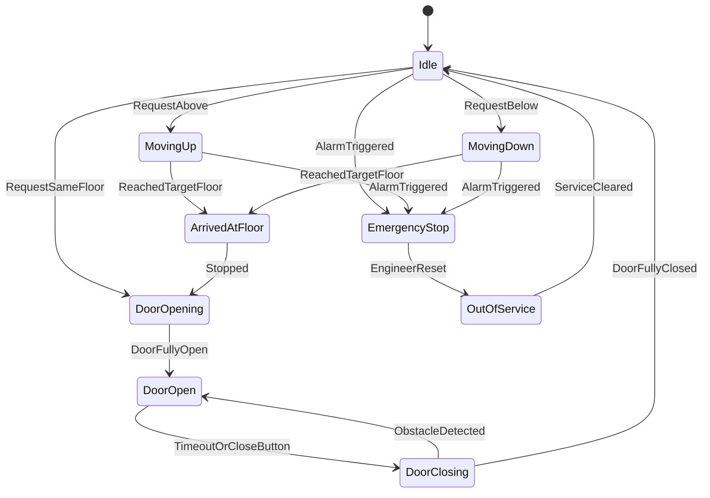
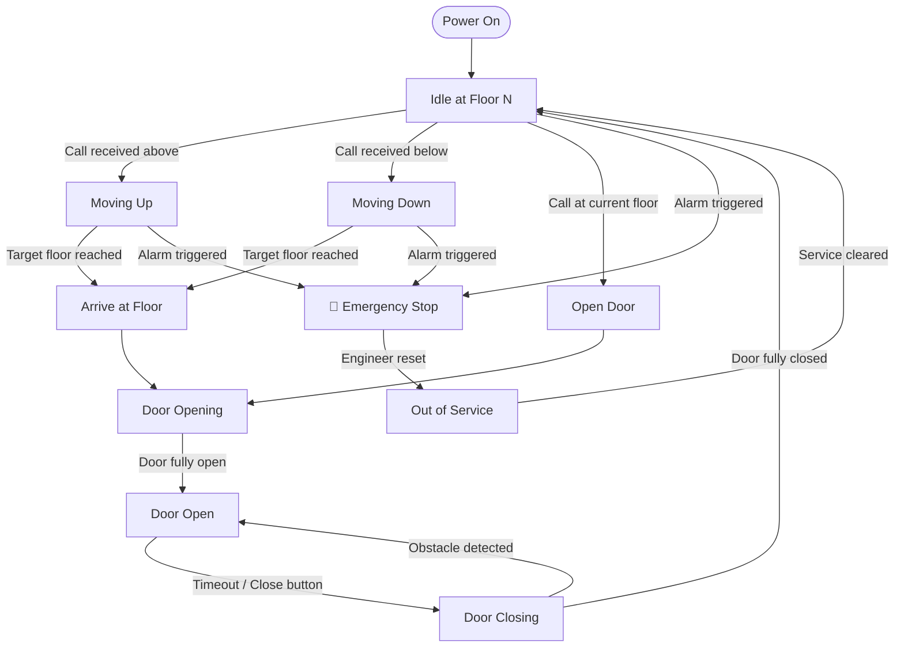
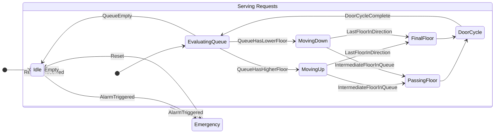
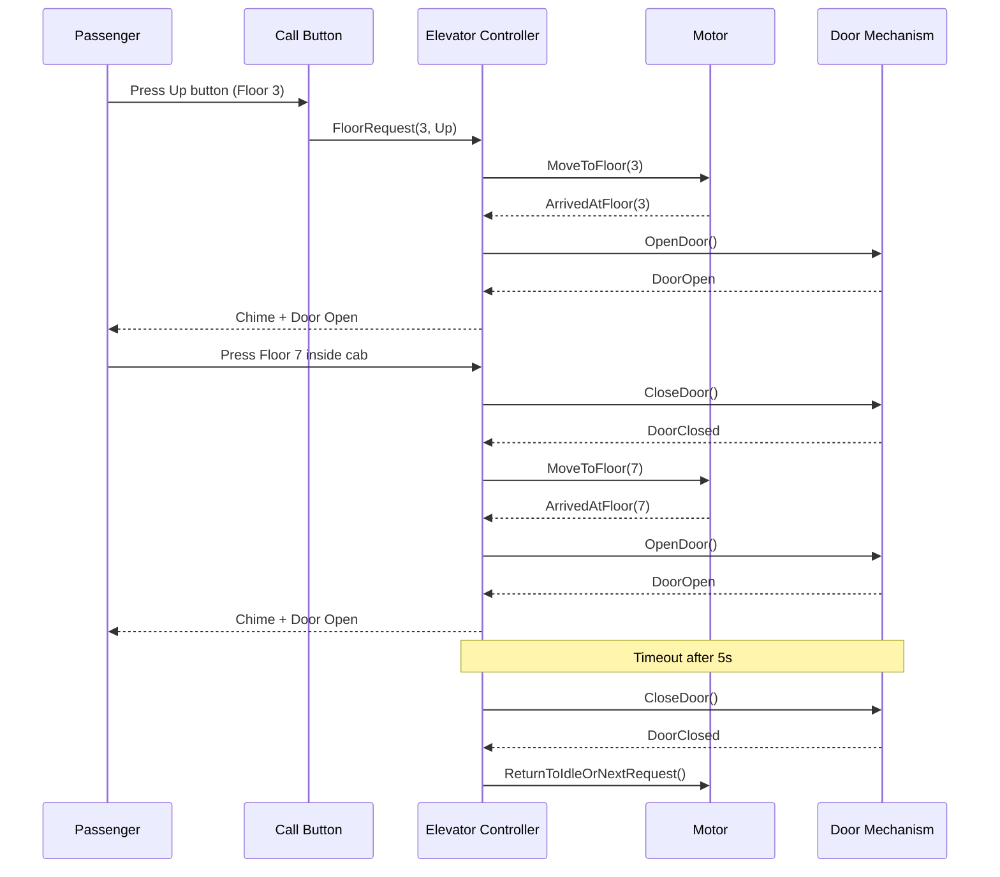

# 🛗 Elevator State Machine — Office Building

> **Why did the elevator break up with the escalator?**
> Because it had too many ups and downs — but the escalator just kept going in one direction.

---

## 🤖💡 Overview

An office building elevator can be modelled as a finite state machine (FSM). The key states revolve around idle waiting, responding to floor calls, moving, and managing door transitions. Edge cases include emergency stops and out-of-service modes.

---

## 📊 Diagram 1 — Core State Diagram (`stateDiagram-v2`)

The cleanest view: pure states and transitions.

---

## 📊 Diagram 2 — Flowchart Style (top-down narrative flow)

A flowchart makes the decision logic more explicit — useful for understanding the control flow in code.

---

## 📊 Diagram 3 — Multi-Floor Context (floors as data, states as nodes)

This diagram shows how floor requests queue up and influence direction decisions.

---

## 📊 Diagram 4 — Sequence Diagram (passenger perspective)

What does a single elevator trip look like from the outside? A sequence diagram captures the interactions between actors.

---

## 🤖💡 Key States Summary

| State           | Description                                              |
|-----------------|----------------------------------------------------------|
| `Idle`          | Elevator at rest on a floor, no pending requests         |
| `MovingUp`      | Travelling upward toward a target floor                  |
| `MovingDown`    | Travelling downward toward a target floor                |
| `ArrivedAtFloor`| Transition state: stopped, about to open doors           |
| `DoorOpening`   | Door motor engaged, opening                              |
| `DoorOpen`      | Doors fully open, waiting for passengers                 |
| `DoorClosing`   | Door motor engaged, closing                              |
| `EmergencyStop` | Alarm triggered, elevator halted in place                |
| `OutOfService`  | Engineer intervention required before resuming           |

---

## 🤖💡 Key Transitions & Guards

| Transition                   | Guard / Trigger                        |
|------------------------------|----------------------------------------|
| `Idle → MovingUp`            | Request exists on a higher floor       |
| `Idle → MovingDown`          | Request exists on a lower floor        |
| `DoorClosing → DoorOpen`     | Obstacle sensor triggered              |
| `DoorClosing → Idle`         | Door fully closed, no pending requests |
| `* → EmergencyStop`          | Alarm signal received in any state     |
| `EmergencyStop → OutOfService`| Engineer resets the alarm              |

---

## 🤖💡 Implementation Notes

- **Direction bias**: Real elevators use a *scan algorithm* (like a disk scheduler) — serve all requests in the current direction before reversing. The queue evaluation in Diagram 3 hints at this.
- **Door re-open**: The `DoorClosing → DoorOpen` obstacle transition is safety-critical and must be hardware-enforced, not just software.
- **Emergency Stop**: Should be reachable from *any* state — modelled here from the most likely states; in production code treat it as a global guard.
- **Idle floor**: Some buildings configure the elevator to return to a "home floor" (e.g., Ground) when idle for N seconds.
